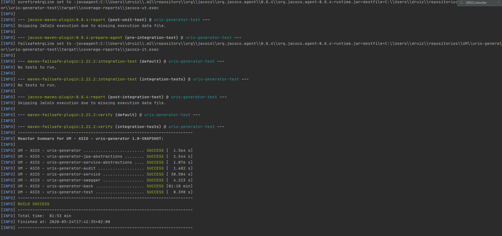
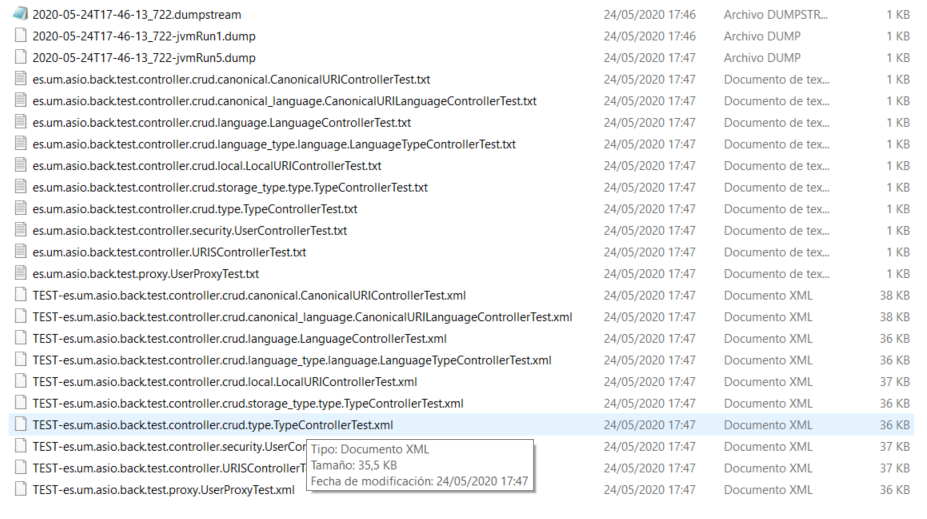
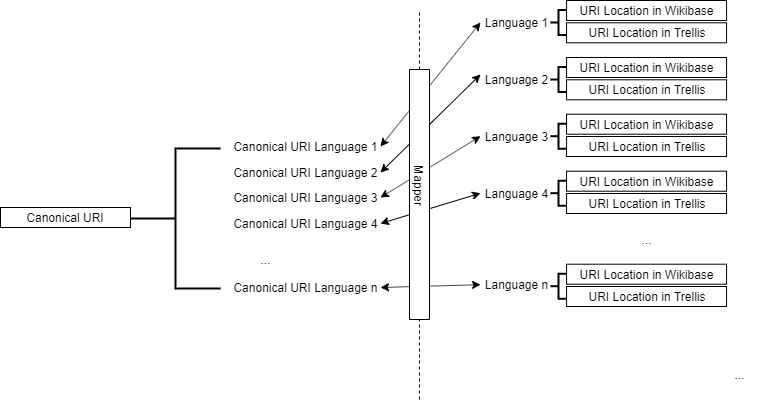

| Entregable     | Librería factoria de URIs                                    |
| -------------- | ------------------------------------------------------------ |
| Fecha          | 25/05/2020                                                   |
| Proyecto       | [ASIO](https://www.um.es/web/hercules/proyectos/asio) (Arquitectura Semántica e Infraestructura Ontológica) en el marco de la iniciativa [Hércules](https://www.um.es/web/hercules/) para la Semántica de Datos de Investigación de Universidades que forma parte de [CRUE-TIC](http://www.crue.org/SitePages/ProyectoHercules.aspx) |
| Módulo         | Arquitectura Semántica                                       |
| Tipo           | Software                                                     |
| Objetivo       | El cumplimiento del requisito de poder intercambiar el Triple Store, impone al proyecto la complejidad de dar soporte a las distintas **URIs privadas**, que sean necesarias para el acceso al recurso a partir de las distintas APIs que para cada uno de los Triple Store, puedan estar desplegadas (actualmente [TDB2](https://jena.apache.org/documentation/tdb2/) [Triple Store] + [Fuseki2](https://jena.apache.org/documentation/fuseki2/) [API LDP] y [Wikibase](https://www.mediawiki.org/wiki/Wikibase/es) [almacenamiento en [BlazeGraph](https://blazegraph.com/) y API en [Wikibase/API](https://wikibase-api.readthedocs.io/en/latest/)]). <br/><br/>Esto hace de la Factoría de URIs un componente vital para el proyecto, ya que permite desacoplar las **URIs privadas** muy ligadas a la tecnologías de almacenamiento (Triple Store) empleadas, de las **URIs públicas** que se definen en los documentos [esquema de URIs](https://github.com/HerculesCRUE/ib-asio-docs-/blob/master/entregables_hito_1/08-Esquema_de_URIs_Hércules/ASIO_Izertis_ArquitecturaDeURIs.md)  , y  [Buenas practicas para URIs Hércules](https://github.com/HerculesCRUE/ib-asio-docs-/blob/master/entregables_hito_1/09-Buenas_prácticas_para_URIs_Hércules/ASIO_Izertis_BuenasPracticasParaURIsHercules.md), que proponen un esquema de URIs, adaptado a las necesidades del proyecto Hércules de forma que estas ofrezcan para cada recurso una URI única, inequívoca, estable, extensible, persistente en el tiempo y ofreciendo garantías de su procedencia, requisitos claves para facilitar su posterior reutilización, basada en los identificadores de recursos uniformes (URIs), para ello cumpliendo los principios de sencillez (URIs cortos y nemotécnicos), escalabilidad (ofrecer flexibilidad en su diseño para dar cabida a aquellos conjuntos de datos, que en el futuro se pudiesen incorporar), manejables (sencillos de administrar), persistentes (dado soporte para mantener la misma URI publica, ante operaciones tales como mover el recurso, eliminarlo o modificarlo, independientemente de que la URI privada pueda cambiar o desaparecer)<br/><br/>Por otro lado es necesario dar un soporte estable al [Modelo de multilingüismo](https://github.com/HerculesCRUE/ib-asio-docs-/blob/master/entregables_hito_1/04-Modelo_multilingüismo/ASIO_Izertis_ModeloMultilinguismo.md), para lo cual la Factoría de URIs, ofrece el modelo propuesto por el esquema de URIs, de ofrecer para las  **URIs públicas** lo que se denomina **URI Canónica** , que identifica la URI única del recurso, y lo que denominaremos **URI Canónica por idioma**, que representa la asociación de la URI Canónica, con la representación de la misma URI canónica, en un idioma especifico, siguiendo el esquema propuesto en el documento [esquema de URIs](https://github.com/HerculesCRUE/ib-asio-docs-/blob/master/entregables_hito_1/08-Esquema_de_URIs_Hércules/ASIO_Izertis_ArquitecturaDeURIs.md), y por otro lado, siguiendo por otro lado la recomendación de mantener la información semántica presente en el documento de [Buenas practicas para URIs Hércules](https://github.com/HerculesCRUE/ib-asio-docs-/blob/master/entregables_hito_1/09-Buenas_prácticas_para_URIs_Hércules/ASIO_Izertis_BuenasPracticasParaURIsHercules.md), se ofrece la posibilidad, de ofrecer la traducción a cada uno de los idiomas, de los componentes que forman la URI, por ejemplo el componente Tipo, para el caso de un recurso, puede ser resource en idioma ingles, o recurso en idioma español. <br/> <br/>Por otro lado la Factoría de URIs implementa la normalización de los componentes, expresada en el documento de [esquema de URIs](https://github.com/HerculesCRUE/ib-asio-docs-/blob/master/entregables_hito_1/08-Esquema_de_URIs_Hércules/ASIO_Izertis_ArquitecturaDeURIs.md) tal y como se expresa en el apartado de [Normalización](#Normalización).<br/> <br/>Por último cabe indicarse que tal como se expresa en el pliego de condiciones, es posible cambiar el esquema de URIs tal como se menciona en el apartado Cambio de esquema |
| Estado         | Implementada al **100%**, según la funcionalidad prevista para cubrir lo expresado en los documentos de [esquema de URIs](https://github.com/HerculesCRUE/ib-asio-docs-/blob/master/entregables_hito_1/08-Esquema_de_URIs_Hércules/ASIO_Izertis_ArquitecturaDeURIs.md)  , y  [Buenas practicas para URIs Hércules](https://github.com/HerculesCRUE/ib-asio-docs-/blob/master/entregables_hito_1/09-Buenas_prácticas_para_URIs_Hércules/ASIO_Izertis_BuenasPracticasParaURIsHercules.md).  Por otro lado la exposición de los EndPoint relativos al [CRUD](https://es.wikipedia.org/wiki/CRUD) sobre modelo de datos completo, hace posible realizar cualquier operación, aunque esta en principio no estuviese prevista. |
| Próximos pasos | -                                                            |
| Documentación  | [Esquema de URIs](https://github.com/HerculesCRUE/ib-asio-docs-/blob/master/entregables_hito_1/08-Esquema_de_URIs_Hércules/ASIO_Izertis_ArquitecturaDeURIs.md)<br/>[Buenas practicas para URIs Hércules](https://github.com/HerculesCRUE/ib-asio-docs-/blob/master/entregables_hito_1/09-Buenas_prácticas_para_URIs_Hércules/ASIO_Izertis_BuenasPracticasParaURIsHercules.md)<br/>[Manual de usuario](./docs/manual_de_usuario.md) (documentación de alto nivel)<br />[Documentación técnica](./docs/documentacion-tecnica.md) (documentación de bajo nivel)<br/>[Documentación API REST de la Factoria de URIs](./docs/documentacion_api_rest_de_la_factoria_de_uris.md) (documentación de bajo nivel)<br/>[build](./docs/build.md)<br/>[docker](./docs/docker.md) |


# ASIO - URIs generator service

|     | Master |
| --- | ------ |
| Quality Gate | [](https://sonarcloud.io/dashboard?id=HerculesCRUE_ib-uris-generator) |
| Coverage | [](https://sonarcloud.io/dashboard?id=HerculesCRUE_ib-uris-generator) |

La Factoría de URIs despliega una API REST con los EndPoints necesarios para implementar todas las operaciones CRUD sobre entidades y los EndPoints de alto nivel propios de la factoría de URIs. Para ello usa una base de datos relacional (MariaDB). La documentación exhaustiva de  el API Rest, puede encontrarse bien en la sección [Swagger](#Swagger) que describe como obtener acceso para interactuar con el API, o bien en la [Documentación API REST de la Factoria de URIs](./docs/documentacion_api_rest_de_la_factoria_de_uris.md) donde se describen también los End Point disponibles. 

## Documentación asociada al proyecto

Para simplificar en la medida de lo posible cualquier tarea que cualquier perfil de usuario pueda requerir, esta a su disposición la siguiente documentación:

- [build](./docs/build.md): Describe los pasos a seguir para el despliegue y/o compilación de la aplicación según el perfil del usuario, ya sea virtualizada o sobre el sistema operativo nativo.
- [docker](./docs/docker.md): Describe los pasos a seguir para generar una imagen docker.
- [Manual de usuario](./docs/manual_de_usuario.md): Describe la funcionalidad de la librería desde el punto de vista de un usuario final.
- [Documentación técnica](./docs/documentacion-tecnica.md): Describe la funcionalidad e implementación de la librería desde el punto de vista de un desarrollador.
- [Documentación API REST de la Factoria de URIs](./docs/documentacion_api_rest_de_la_factoria_de_uris.md): Describe todos los EndPoint desplegados por la librería Factoría de URIs

## Módulos disponibles

* **Módulo back**: módulo que añade una capa de servicios REST a la funcionalidad de la aplicación. Genera un artefacto JAR bootable
* **Módulo service**: módulo que contiene la lógica de la aplicación. Puede ser utilizado como librería independiente para ser integrado en otras aplicaciones
* **Módulo jpa-abstractions**: módulo con utilidades para el acceso a datos mediante JPA
* **Módulo service-abstractions**: módulo con utilidades para la generación de servicios
* **Módulo swagger**: módulo que contiene la funcionalidad necesaria para añadir Swagger para la interacción con el API Rest
* **Módulo audit**: módulo que contiene la funcionalidad necesaria para la generación de datos de auditoría para las tablas de base de datos

## Metodología de desarrollo

La metodología de desarrollo es Git Flow.


## Entorno de desarrollo Docker

* MariaDB 10.3


La inicialización de los elementos adicionales al entorno de desarrollo se realiza con docker. 

En el directorio docker-devenv se ha configurado un fichero docker-compose.yml para poder arrancar el entorno de desarrollo.

Para arrancar el entorno:

```bash
docker-compose up -d
```

Para pararlo:

```bash
docker-compose down
```

## Variables de entorno

La configuración se encuentra en el fichero application.yml

Esta puede ser sustituida por las siguientes variables de entorno disponibles en la maquina donde se realiza el despliegue, lo que hará que sea posible realizar una configuración suficiente para cualquier entorno.

| Nombre | Valor |
|--------|:-----:|
| `APP_PERSISTENCE_DATASOURCE_DRIVER-CLASS-NAME` | org.mariadb.jdbc.Driver  |
| `APP_PERSISTENCE_DATASOURCE_USERNAME` | root  |
| `APP_PERSISTENCE_DATASOURCE_PASSWORD` | root  |
| `APP_PERSISTENCE_DATASOURCE_URL` | jdbc:mariadb://127.0.0.1:3307/uris?ssl=false  |
| `APP_URI_CANONICALURISCHEMA` | http://$domain$/$sub-domain$/$type$/$concept$/$reference$ |
| `APP_URI_CANONICALURILANGUAGESCHEMA` | http://$domain$/$sub-domain$/$language$/$type$/$concept$/$reference$ |

## Ejecución

Al generarse un JAR bootable la ejecución se realizará mediante el siguiente comando:

```bash
java -jar {jar-name}.jar
```

Sustituyendo `{jar-name}` por el nombre del fichero JAR generado.

No es necesario especificar la clase de inicio de la aplicación, ya que el fichero MANIFEST.MF generado ya contiene la información necesaria. Solamente se especificarán los parámetros necesarios.


## Swagger

Se ha añadido la posibilidad de utilizar Swagger. Para acceder a Swagger, se utilizará la siguiente URL:

* http://localhost:9326/swagger-ui.html

Para activar swagger se utilizará la variable `app.swagger.enabled`

## Testing y cobertura

Se incluyen los resultados del testing y cobertura en los siguientes enlaces:

- [Testing TDD](http://herc-iz-front-desa.atica.um.es:8070/uris-generator/surefire/surefire-report.html)
- [Cobertura TDD](https://sonarcloud.io/component_measures?id=HerculesCRUE_ib-uris-generator&metric=coverage&view=list)
- [Testing BDD](docs/testing.md)

Para todos los End Point desplegados se ha creado su oportuno **test de integración**.

La ejecución de los test puede ser invocada mediante el comando

```bash
mvn clean verify
```

y el resultado se puede obtener bien en el log del propio comando



o en la ruta `\uris-generator\[nombre del módulo]\target\surefire-reports`



 ## Mapeo de URIs

El mapeo de URIS sigue el siguiente esquema:

 

El esquema muestra en la parte izquierda, las denominadas **URIs publicas o externas**, dichas URIs, como se ha comentado con anterioridad siguen el esquema definido en el documento [esquema de URIs](https://github.com/HerculesCRUE/ib-asio-docs-/blob/master/entregables_hito_1/08-Esquema_de_URIs_Hércules/ASIO_Izertis_ArquitecturaDeURIs.md), siguiendo el patrón en la construcción de las URIs descrito en el apartado Cambio de esquema disponible en este mismo documento.

Como raíz del esquema encontramos la **URI Canónica** que será URI que proporcionara un identificador, que de manera inequívoca, identificara una entidad de algún tipo ya sea una clase, una propiedad o una instancia de un objeto.  

Dicha URI Canónica, tendrá tantas URIs **URIs Canónicas por idioma**, como representaciones del recurso en distintos idiomas haya disponible. Siempre existirá un lenguaje por defecto, de forma que si la petición del recurso, para un determinado lenguaje, no pudiese satisfacerse, en sustitución, se facilitará la URI Canónica por idioma, que se haya configurado por defecto.

Por otro lado las **URIs privadas o internas** proporcionan la ubicación real del recurso, en un determinado sistema de almacenamiento, de forma que siempre será posible la obtención del recurso en un idioma y sistema de almacenamiento concreto, mediante una invocación a su URI Canónica, con los parámetros de idioma y tipo de almacenamiento.

Este mapeo es bidireccional, es decir también se podrá obtener la URI Canónica o Canónica por idioma, dado una URI de almacenamiento local.

 ## Cambio de esquema

En cumplimiento del requisito de cambio de esquema de URIs, expresado en el pliego, se establece el siguiente mecanismo para su implementación.

Tanto en el fichero de configuración application.yaml como mediante la variable de entorno APP_URI_CANONICALURISCHEMA o APP_URI_CANONICALURILANGUAGESCHEMA es posible cambiar el patrón tanto de URIs Canónicas como de dichas URIs Canónicas por idioma (incluso de forma distinta para cada caso).

Los componentes de la URI, son los descritos en el documento de  [esquema de URIs](https://github.com/HerculesCRUE/ib-asio-docs-/blob/master/entregables_hito_1/08-Esquema_de_URIs_Hércules/ASIO_Izertis_ArquitecturaDeURIs.md), siguiendo el patrón para URIs Canónicas:

**http://{dominio}/[{subdominio}]/{tipo}/{concepto}[/{referencia}]**

Y  para URIs Canónicas para un determinado idioma:

**http://{dominio}/[{subdominio}]/{idioma}/{tipo}/{concepto}[/{referencia}]**

El esquema se define de la forma

```bash
# Canonical Schema
APP_URI_CANONICALURISCHEMA  = http://$domain$/$sub-domain$/$type$/$concept$/$reference$ 
# Canonical Langauge Schema
APP_URI_CANONICALURILANGUAGESCHEMA = http://$domain$/$sub-domain$/$type$/$concept$/$reference$
```

Donde podremos eliminar (algunos opcionales, tales como el sub-domain) o modificar el orden de los componentes (dichos componentes se definen en el documento de [esquema de URIs](https://github.com/HerculesCRUE/ib-asio-docs-/blob/master/entregables_hito_1/08-Esquema_de_URIs_Hércules/ASIO_Izertis_ArquitecturaDeURIs.md))


 ## Normalización

La Factoría de URIs implementa la normalización descrita en el documento [esquema de URIs](https://github.com/HerculesCRUE/ib-asio-docs-/blob/master/entregables_hito_1/08-Esquema_de_URIs_Hércules/ASIO_Izertis_ArquitecturaDeURIs.md), concretamente todos los puntos detallados a continuación:

- Han de ser únicos (al menos en su dominio). 
- Usar siempre minúsculas, salvo para los conceptos que podrán tener la primera letra en mayúscula.
- Eliminar caracteres propios de el idioma, tales como acentos, o signos de puntuación.
- Usar el guión medio (-) como separador de palabras.

##  Documentación adicional

* [Compilación](docs/build.md)
* [Generación Docker](docs/docker.md)
