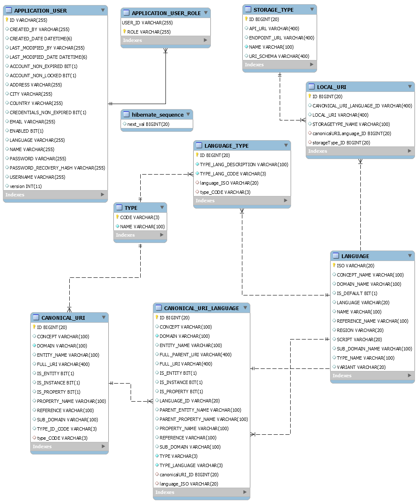
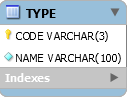
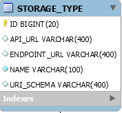
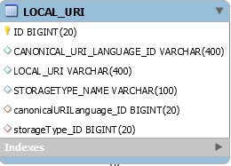

# Documentación técnica para la Factoría de URIs 

| Entregable     | Documentación de la librería factoría de URIs                |
| -------------- | ------------------------------------------------------------ |
| Fecha          | 25/05/2020                                                   |
| Proyecto       | [ASIO](https://www.um.es/web/hercules/proyectos/asio) (Arquitectura Semántica e Infraestructura Ontológica) en el marco de la iniciativa [Hércules](https://www.um.es/web/hercules/) para la Semántica de Datos de Investigación de Universidades que forma parte de [CRUE-TIC](https://www.crue.org/proyecto/hercules/) |
| Módulo         | Arquitectura Semántica                                       |
| Tipo           | Documento                                                    |
| Objetivo       | El presente documento pretende ser la documentación técnica relativa a el entregable Factoría de URIs. Para ello, se documentaran exhaustivamente tanto los aspectos relativos a su despliegue, como todos los End Point que esta ofrece a otros procesos o usuarios, para interactuar con la misma. |
| Estado         | Implementada al **100%**, según la funcionalidad prevista para cubrir lo expresado en los documentos de [esquema de URIs](https://github.com/HerculesCRUE/ib-asio-docs-/blob/master/entregables_hito_1/08-Esquema_de_URIs_Hércules/ASIO_Izertis_ArquitecturaDeURIs.md)  , y  [Buenas practicas para URIs Hércules](https://github.com/HerculesCRUE/ib-asio-docs-/blob/master/entregables_hito_1/09-Buenas_prácticas_para_URIs_Hércules/ASIO_Izertis_BuenasPracticasParaURIsHercules.md).  Por otro lado la exposición de los EndPoint relativos al CRUD sobre modelo de datos completo, hace posible realizar cualquier operación, aunque esta en principio no estuviese prevista. |
| Próximos pasos | La integración con componentes desarrollados en una fase de madurez no final, o otros por desarrollar (tales como el servicio de publicación web), quizás requieran la modificación o creación de algún EndPoint adicional, aunque según lo descrito en el apartado anterior, dado que existe un CRUD completo sobre todas las entidades, la implementación, debería de ser trivial. |
| Documentación  | [Esquema de URIs](https://github.com/HerculesCRUE/ib-asio-docs-/blob/master/entregables_hito_1/08-Esquema_de_URIs_Hércules/ASIO_Izertis_ArquitecturaDeURIs.md)<br/>[Buenas practicas para URIs Hércules](https://github.com/HerculesCRUE/ib-asio-docs-/blob/master/entregables_hito_1/09-Buenas_prácticas_para_URIs_Hércules/ASIO_Izertis_BuenasPracticasParaURIsHercules.md)<br/>[Manual de usuario](./manual_de_usuario.md) (documentación de alto nivel)<br />[Documentación API REST de la Factoría de URIs](documentacion_api_rest_de_la_factoria_de_uris.md)<br/>[build](./build.md)<br/>[docker](./docker.md) |


## Despliegue

Se puede encontrar documentación exhaustiva de desplieguen en el documento [build](./build.md) tanto para usuarios finales como para desarrolladores.

### Requisitos

* OpenJDK 11
* Maven 3.6.x
* Docker

### Compilación

Para realizar la compilación se ejecutará el siguiente comando:

```bash
mvn clean package
```

También sería posible instalar o desplegar los artefactos sustituyendo `package` por `install` o `deploy` respectivamente.

Los artefactos se generarán dentro del directorio `target` de cada uno de los módulos:

#### Módulo Back

Módulo que añade una capa de servicios REST a la funcionalidad de la aplicación.

Los artefactos se encuentran dentro de uris-generator-back/target

* Artefacto: uris-generator-back-{version}.jar

#### Módulo Service

Módulo que contiene la lógica de la aplicación. Puede ser utilizado como librería independiente para ser integrado en otras aplicaciones

* Los artefactos se encuentran dentro de triples-storage-adapter-service-abstractions/target

  * Artefacto: triples-storage-adapter-service-abstractions-{version}.jar

#### Módulo jpa-abstractions

Módulo con utilidades para el acceso a datos mediante JPA.

#### Módulo service-abstractions

Módulo con utilidades para la generación de servicios.

#### Módulo swagger

Módulo que contiene la funcionalidad necesaria para añadir [Swagger](https://swagger.io/) para la interacción con el API Rest.

#### Módulo audit

Módulo que contiene la funcionalidad necesaria para la generación de datos de auditoría para las tablas de base de datos.

### Ejecución

Al generarse un JAR bootable la ejecución se realizará mediante el siguiente comando:

```bash
java -jar {jar-name}.jar
```

Sustituyendo `{jar-name}` por el nombre del fichero JAR generado.

No es necesario especificar la clase de inicio de la aplicación, ya que el fichero MANIFEST.MF generado ya contiene la información necesaria. Solamente se especificarán los parámetros necesarios.

### Ejecución de test

Los test de integración pueden ejecutarse con el siguiente comando

```bash
mvn clean verify
```

Esto generara reportes sobre el resultado de dichos test, disponibles en la ruta 

```
./target/surefire-reports
```

### Modelo de datos

Es conveniente para mejorar la comprensión, ver la representación del modelo de datos que soporta la librería de URIs y se encuentra desplegado en MariaDB

### 

Entre las entidades presentes en el esquema podemos destacar:

- **Entidad TYPE:** Representa el componente tipo, descrito en el  [Esquema de URIs](https://github.com/HerculesCRUE/ib-asio-docs-/blob/master/entregables_hito_1/08-Esquema_de_URIs_Hércules/ASIO_Izertis_ArquitecturaDeURIs.md). El atributo code actua como calve primaria y representa el código (de 3 caracteres) que será usado en el esquema de URIs, para las URIs canónicas y el atributo name, su descripción larga.

  

- **Entidad LANGUAGE:** Modela los atributos necesarios para el modelado de un lenguaje aplicable al proyecto de Factoría de URIS. El atributo ISO, representa el idioma en codigo ISO 639-1, otros atributos tales como LANGUAGE, NAME, REGION, SCRIPT y VARIANT, representan metadatos extraídos de ese mismo código, y los atributos DOMAIN_NAME, SUB_DOMAIN_NAME, TYPE_NAME, CONCEPT_NAME y REFERENCE_NAME, representan la traducción al idioma indicado de los componentes del esquema de URIS  dominio, sub-dominio, tipo, concepto y referencia respectivamente. Por otro lado cabe destacar el atributo IS_DEFAULT, que determina si este, es el idioma por defecto. Solo un idioma podrá ser  definido como idioma por defecto y es obligado que este definido uno.


- **Entidad LANGUAGE_TYPE:** Modela la unión de un lenguaje y un tipo, y por lo tanto ofrece la traducción de dicho tipo al lenguaje indicado, incluso en la construcción de la URI Canónica por idioma.

  

- **Entidad STORAGE_TYPE:** La entidad **STORAGE_TYPE** almacena información relativa al un determinado tipo de almacenamiento, por ejemplo en el estado actual del proyecto, Trellis y Wikibase. Mantiene asimismo la capacidad de guardar metadatos relativos a dichos sistemas tales como la URL del EndPoint SPARQL o de su API .




- **Entidad CANONICAL_URI:** La entidad **CANONICAL_URI** representa un URI canónica para un determinado recurso, ya sea una clase, una propiedad o una instancia. 


- **Entidad CANONICAL_URI_LANGUAGE:** La entidad **CANONICAL_URI** representa un URI canónica para un determinado recurso, ya sea una clase, una propiedad o una instancia. 

  


- **Entidad LOCAL_URI**: La entidad **LOCAL_URI** representa un URI local asociada con una URI Canónica por idioma y un tipo de almacenamiento. 

  

### Implementación

El proyecto esta desarrollado sobre el arquetipo de Izertis para APIs REST, desarrollado sobre el Framework [Spring Boot](https://spring.io/projects/spring-boot), usando el [patrón MVC](https://es.wikipedia.org/wiki/Modelo–vista–controlador).

Para separar convenientemente los controladores que manejan las peticiones todos ellos se encapsulan en el modulo **uris-generator-back**, donde a su vez podemos encontrar el directorio **crud** que encapsula todos los controladores destinados a realizar operaciones (GET, POST o DELETE) atómicas sobre los datos.

Entre dichos controladores podemos encontrar los siguientes:

- **TypeController: ** Controlador que gestiona todas las peticiones sobre la entidad TYPE, que representa el componente tipo, descrito en el  [Esquema de URIs](https://github.com/HerculesCRUE/ib-asio-docs-/blob/master/entregables_hito_1/08-Esquema_de_URIs_Hércules/ASIO_Izertis_ArquitecturaDeURIs.md).
- **LanguageController: ** Controlador que gestiona todas las peticiones sobre la entidad LANGUAGE, que implementa los atributos de un determinado.
- **LanguageTypeController: ** Controlador que gestiona todas las peticiones CRUD sobre la entidad LANGUAGE_TYPE.
- **StorageTypeController: ** Controlador que gestiona todas las peticiones CRUD sobre la entidad STORAGE_TYPE.
- **CanonicalUriController: ** Controlador que gestiona todas las peticiones CRUD sobre la entidad CANONICAL_URI
- **CanonicalUriLangaugeController: ** Controlador que gestiona todas las peticiones CRUD sobre la entidad CANONICAL_URI_LANGUAGE
- **LocalUriController: ** Controlador que gestiona todas las peticiones CRUD sobre la entidad LOCAL_URI.

En dicho modulo también podemos encontrar el controlador **URISController**, que implementa el controlador de la factoría de URIs, que realiza operaciones de alto nivel, mas complejas, apoyándose en los controladores anteriormente descritos.

Los end Point desplegados por estos controladores están ampliamente descritos tanto en Swagger, como en la documentación [Documentación API REST de la Factoria de URIs](./documentacion_api_rest_de_la_factoria_de_uris.md), creada para tal efecto.

Por otro lado el módulo **uris-generator-service** contiene la logica de la aplicación, siguiendo la siguiente estructura:

- relativos a los datos:
  - **model:** para el modelo de dominio (entidades JPA), donde se mapean las entidades con tablas y lso atributos de dichas entidades con columnas.
  - **dto:** para Data Transfer Object serializables.
  - **mapper:** para Data mapeos, principalmente entre entidades y dto.
- relativo al acceso a los datos
  - **filter:** para definir filtros aplicables en las queries.
  - **repository**: JpaRepository donde definir los métodos para acceso a datos
- relativo a logica de negocio:
  - **service:** Logica de negocio, que usando el repositorio, obtiene los datos a partir del repositorio y los filtros, realiza las operaciones necesarias, y retorna el resultado.
  - **proxy:** Conversiones de los datos, obtenidos por el servicio.

### Metodología de desarrollo

La metodología de desarrollo es [Git Flow](https://www.atlassian.com/es/git/tutorials/comparing-workflows/gitflow-workflow).

### Entorno de desarrollo Docker

La generación de la imagen Docker y su despliegue están descritas en el documento [Generación Docker](./docker.md)

También es necesario desplegar el entorno de servicios necesarios, por ejemplo MariaDB.

Para ello existe en el directorio **docker-devenv** el dichero docker-compose.yml que despliega dicho entorno. Para ello es suficiente ejecutar los siguientes comandos:

 Para arrancar el entorno:

```bash
docker-compose up -d
```

Para pararlo:

```bash
docker-compose down
```

### Variables de entorno

La configuración se encuentra en el fichero application.yml

Esta puede ser sustituida por las siguientes variables de entorno disponibles en la maquina donde se realiza el despliegue

| Nombre                                         |                            Valor                             |
| ---------------------------------------------- | :----------------------------------------------------------: |
| `APP_PERSISTENCE_DATASOURCE_DRIVER-CLASS-NAME` |                   org.mariadb.jdbc.Driver                    |
| `APP_PERSISTENCE_DATASOURCE_USERNAME`          |                             root                             |
| `APP_PERSISTENCE_DATASOURCE_PASSWORD`          |                           root                               |
| `APP_PERSISTENCE_DATASOURCE_URL`               |         jdbc:mariadb://127.0.0.1:3307/uris?ssl=false         |
| `APP_URI_CANONICALURISCHEMA`                   |  http://$domain$/$sub-domain$/$type$/$concept$/$reference$   |
| `APP_URI_CANONICALURILANGUAGESCHEMA`           | http://$domain$/$sub-domain$/$language$/$type$/$concept$/$reference$ |


### Swagger

Se desplegara un API Swagger automáticamente al desplegar el proyecto.

El API esta disponible en

[http://{HOST_FACTORIA_URIS}:[SWAGGER_PORT]/swagger-ui.html](http://localhost:9326/swagger-ui.html)

Para activar Swagger se utilizará la variable `app.swagger.enabled`


## API REST de Factoría de URIS

El API Rest en su totalidad se encuentra documentado, mediante Swagger.

Swagger se desplegara de forma automática,  al ejecutar el proyecto, en el mismo host y el mismo puerto configurado en el application.yml.

Por lo tanto se podrá acceder a Swagger mediante una URL de es siguiente formato:  

[http://{HOST_FACTORIA_URIS}:[SWAGGER_PORT]/swagger-ui.html](http://localhost:9326/swagger-ui.html)

En caso de ejecutar en la maquina local, con la configuración presente actualmente en el fichero application.yml, la URI resultante será

http://localhost:9326/swagger-ui.html

Obteniendo el siguiente resultado


Por otro lado, puede encontrarse una documentación exhaustiva de los Endpoint desplegados por el API, en el documento

[Documentación API REST de la Factoría de URIs](documentacion_api_rest_de_la_factoria_de_uris.md)