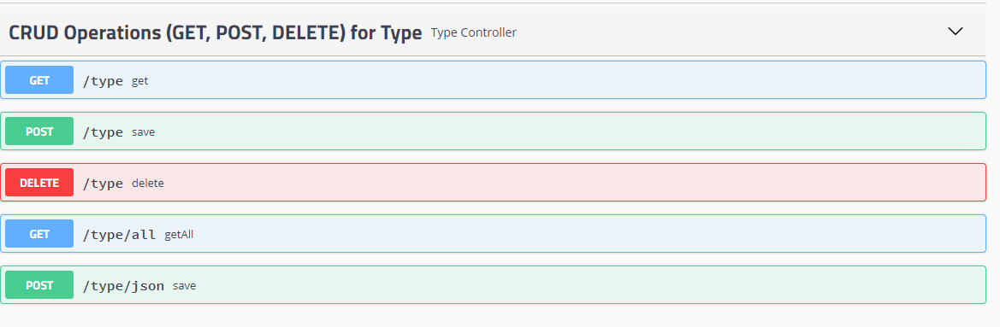
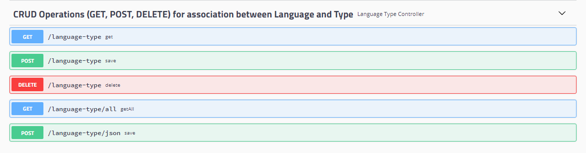
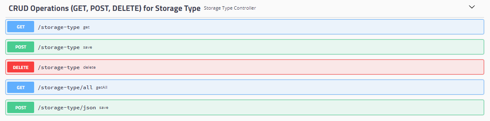
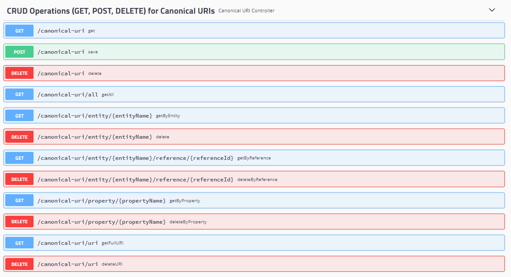
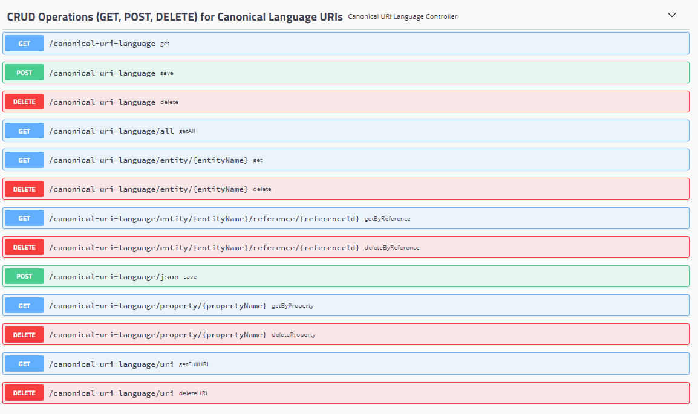
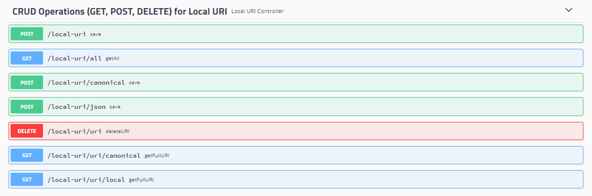

| Fecha         | 25/05/2020                                                   |
| ------------- | ------------------------------------------------------------ |
| Proyecto      | [ASIO](https://www.um.es/web/hercules/proyectos/asio) (Arquitectura Semántica e Infraestructura Ontológica) en el marco de la iniciativa [Hércules](https://www.um.es/web/hercules/) para la Semántica de Datos de Investigación de Universidades que forma parte de [CRUE-TIC](https://www.crue.org/proyecto/hercules/) |
| Módulo        | Arquitectura Semántica                                       |
| Tipo          | Documentación                                                |
| Objetivo      | El presente documento describe los EndPoint expuestos por la librería Factoría de URIs |
| Documentación | [Esquema de URIs](https://github.com/HerculesCRUE/ib-asio-docs-/blob/master/08-Esquema_de_URIs_Hércules/ASIO_Izertis_ArquitecturaDeURIs.md)<br/>[Buenas practicas para URIs Hércules](https://github.com/HerculesCRUE/ib-asio-docs-/blob/master/09-Buenas_prácticas_para_URIs_Hércules/ASIO_Izertis_BuenasPracticasParaURIsHercules.md)<br/>[Manual de usuario](./manual_de_usuario.md) (documentación de alto nivel)<br />[Documentación técnica](./documentacion-tecnica.md) (documentación de bajo nivel)<br/>[Documentación API REST de la Factoria de URIs](./documentacion_api_rest_de_la_factoria_de_uris.md) (documentación de bajo nivel)<br/>[README](../README.md)<br/>[docker](./docker.md)<br/>[build](./build.md) |

# API REST de Factoría de URIS

La documentación de esta sección hará referencia a cada uno de los EndPoints desplegados por la librería de URIs, apoyándose en la documentación proporcionada por Swagger, por lo tanto los enlaces que se facilitan para los EndPoint descritos en Swagger, solo estarán disponibles se ha realizado el despliegue, y dicho despliegue se ha realizado en la misma máquina donde se encuentra la presente documentación. En otro caso es necesario cambiar el host y el puerto por aquellos donde la librería de URIs ha sido desplegada.

La librería de URIs despliega dos grandes módulos de EndPoints uno para todas aquellas operaciones CRUD "Atómicas", para cada una de las entidades representadas en el modelo de datos y otra, para las operaciones implementadas por la factoría de URIs. En esta sección se documentaran ambas:

### CRUD API REST

#### Operaciones sobre la entidad TYPE

La entidad **Type** representa el tipo ($type$) disponible en el esquema de URIS

```
# Canonical Schema
Esquema canonico -> http://$domain$/$sub-domain$/$type$/$concept$/$reference$ 
# Canonical Langauge Schema
Esquema canonico por idioma -> http://$domain$/$sub-domain$/$type$/$concept$/$reference$
```

Es necesaria para el multilingüismo ya que la combinación de un tipo con un idioma, permitirá acceder a la traducción de dicho tipo.


##### Implementación

Es implementado por el controlador TypeController

##### Test

Test de integración disponibles en TypeControllerTest

##### EndPoints



###### GET /type

Disponible en Swagger el siguiente [enlace](http://localhost:9326/swagger-ui.html#/CRUD Operations (GET, POST, DELETE) for Type/getUsingGET_5)

**Semántica**

Obtención de un recurso por su código

**Parámetros**

- **code:** (Requerido) Código del tipo a recuperar

**Petición**

```
curl -X GET "http://localhost:9326/type?code=res" -H "accept: */*"
```

**Respuesta**

```
{
  "code": "res",
  "name": "resources"
}
```

###### POST /type

Disponible en Swagger el siguiente [enlace](http://localhost:9326/swagger-ui.html#/CRUD Operations (GET, POST, DELETE) for Type/getUsingGET_5)

**Parámetros**

- **code:** (*Requerido) Código del tipo a insertar
- **name:** (*Opcional) Nombre del codigo de tipo a insertar. Si no se indica, por defecto se crea con el mismo nombre que el pasado en el parámetro code.

**Semántica**

Inserción de un recurso por su código y nombre

**Petición**

```
curl -X POST "http://localhost:9326/type?code=res&name=res" -H "accept: */*"
```

**Respuesta**

```
{
  "code": "res",
  "name": "res"
}
```

###### DELETE /type

Disponible en Swagger el siguiente [enlace](http://localhost:9326/swagger-ui.html#/CRUD Operations (GET, POST, DELETE) for Type/getUsingGET_5)

**Parámetros**

- **code:** (*Requerido) Código del tipo a borrar

**Semántica**

Borrado de un recurso por su código y nombre

**Petición**

```
curl -X DELETE "http://localhost:9326/type?code=res" -H "accept: */*"
```

**Respuesta**:

```
Status 200 OK
```

###### GET /type/all

Disponible en Swagger el siguiente [enlace](http://localhost:9326/swagger-ui.html#/CRUD Operations (GET, POST, DELETE) for Type/getUsingGET_5)

**Semántica**

Obtención de todos los recursos.

**Parámetros**

Ninguno

**Petición**

```
curl -X GET "http://localhost:9326/type/all" -H "accept: */*"
```

**Respuesta**

```
[
  {
    "code": "cat",
    "name": "catalog"
  },
  {
    "code": "def",
    "name": "definitions"
  },
  {
    "code": "kos",
    "name": "skos"
  },
  {
    "code": "res",
    "name": "res"
  }
]
```

###### POST /type/json

Disponible en Swagger el siguiente [enlace](http://localhost:9326/swagger-ui.html#/CRUD Operations (GET, POST, DELETE) for Type/getUsingGET_5)

**Semántica**

Inserción de un tipo en formato json.

**Parámetros**

- (Requerido) JSON del tipo a insertar enviado el body de la petición

```
curl -X POST "http://localhost:9326/type/json" -H "accept: */*" -H "Content-Type: application/json" -d "{ \"code\": \"cat\", \"name\": \"category\"}"
```

**Respuesta**

```
{
  "code": "cat",
  "name": "category"
}
```

#### Operaciones sobre la entidad LANGUAGE

La entidad **LANGUAGE** representa un determinado idioma y la traducción de los componentes que aparecen en el  [Esquema de URIs](https://github.com/HerculesCRUE/ib-asio-docs-/blob/master/entregables_hito_1/08-Esquema_de_URIs_Hércules/ASIO_Izertis_ArquitecturaDeURIs.md)

Es necesaria para el multilingüismo ya que la combinación de una URI Canónica con un lenguaje, dará como resultado una URI Canonical en un determinado idioma.


Otro atributo de importancia en la entidad Language es IS_DEFAULT, que establece si es el idioma por defecto, que será el retornado en caso de hacerse una solicitud a una URI Canoníca, indicando un recurso en un idioma no disponible para dicho recurso.

##### Implementación

Es implementado por el controlador LanguageController

##### Test

Test de integración disponibles en LanguageControllerTest

##### EndPoints


###### GET /language

Disponible en Swagger el siguiente [enlace](http://localhost:9326/swagger-ui.html#/CRUD Operations (GET, POST, DELETE) for Type/getUsingGET_5)

**Semántica**

Obtención de un idioma por su código ISO 639-1

**Parámetros**

- **ISO:** (Requerido) Código del lenguaje (ISO 639-1) a recuperar

**Petición**

```
curl -X GET "http://localhost:9326/language?ISO=es-ES" -H "accept: */*"
```

**Respuesta**

```
{
  "iso": "es-ES",
  "languageStr": "español",
  "region": "España",
  "variant": null,
  "script": null,
  "name": "Español",
  "domain": "dominio",
  "subDomain": "sub-dominio",
  "type": "tipo",
  "concept": "concepto",
  "reference": "referencia",
  "isDefault": true
}
```

###### POST /language

Disponible en Swagger el siguiente [enlace](http://localhost:9326/swagger-ui.html#/CRUD Operations (GET, POST, DELETE) for Type/getUsingGET_5)

**Parámetros**

- **ISO:** (Requerido) Código del lenguaje (ISO 639-1) a recuperar
- **domain:** (*Opcional) Nombre del componente de la URI **dominio** en idioma indicado, si no se indica ninguno, se asume el mismo que el del idioma por defecto.
- **subDomain:** (*Opcional) Nombre del componente de la URI **sub-domain** en idioma indicado, si no se indica ninguno, se asume el mismo que el del idioma por defecto.
- **type:** (*Opcional) Nombre del componente de la URI **type** en idioma indicado, si no se indica ninguno, se asume el mismo que el del idioma por defecto. Este aparecerá traducido en las URIS Canónicas por Idioma, según el contenido de este atributo.
- **concept:** (*Opcional) Nombre del componente de la URI **concepto** en idioma indicado, si no se indica ninguno, se asume el mismo que el del idioma por defecto.
- **reference:** (*Opcional) Nombre del componente de la URI **referencia** en idioma indicado, si no se indica ninguno, se asume el mismo que el del idioma por defecto.
- **isDefault:** (*Opcional) Indica si el idioma indicado es el idioma por defecto. Solo puede haber 1 idioma por defecto, asi que si se indica, cualquier otro que lo fuese hasta ese momento, dejara de serlo. Si no se indica ninguno, se asume que no lo es.
- **name:** (*Opcional) Nombre del idioma, si no se indica ninguno, se aplicara el codigo ISO.

**Semántica**

Inserción de un idioma, ofreciendo configuración y traducción de los componentes de la URI.

**Petición**

```
curl -X POST "http://localhost:9326/language?ISO=pt-PT&concept=conceito&domain=dom%C3%ADnio&isDefault=false&name=nome&reference=refer%C3%AAncia&subDomain=%20sub-dom%C3%ADnio&type=tipo" -H "accept: */*"
```

**Respuesta**

```
{
  "iso": "pt-PT",
  "languageStr": "portugués",
  "region": "Portugal",
  "variant": null,
  "script": null,
  "name": "nome",
  "domain": "domínio",
  "subDomain": " sub-domínio",
  "type": "tipo",
  "concept": "conceito",
  "reference": "referência",
  "isDefault": false
}
```

###### DELETE /language

Disponible en Swagger el siguiente [enlace](http://localhost:9326/swagger-ui.html#/CRUD Operations (GET, POST, DELETE) for Type/getUsingGET_5)

**Parámetros**

- **ISO:** (*Requerido) Código del idioma a borrar

**Semántica**

Borrado de un recurso por su código y nombre

**Petición**

```
curl -X DELETE "http://localhost:9326/language?ISO=pt-PT" -H "accept: */*"
```

**Respuesta**:

```
Status 200 OK
```

###### GET /language/all

Disponible en Swagger el siguiente [enlace](http://localhost:9326/swagger-ui.html#/CRUD Operations (GET, POST, DELETE) for Type/getUsingGET_5)

**Semántica**

Obtención de todos los idiomas.

**Parámetros**

Ninguno

**Petición**

```
curl -X GET "http://localhost:9326/type/all" -H "accept: */*"
```

**Respuesta**

```
[
  {
    "iso": "en-EN",
    "languageStr": "inglés",
    "region": "EN",
    "variant": null,
    "script": null,
    "name": "English",
    "domain": "domain",
    "subDomain": "sub-domain",
    "type": "type",
    "concept": "concept",
    "reference": "reference",
    "isDefault": false
  },
  {
    "iso": "es-ES",
    "languageStr": "español",
    "region": "España",
    "variant": null,
    "script": null,
    "name": "Español",
    "domain": "dominio",
    "subDomain": "sub-dominio",
    "type": "tipo",
    "concept": "concepto",
    "reference": "referencia",
    "isDefault": true
  }
]
```

###### POST /language/json

Disponible en Swagger el siguiente [enlace](http://localhost:9326/swagger-ui.html#/CRUD Operations (GET, POST, DELETE) for Type/getUsingGET_5)

**Semántica**

Inserción de un idioma en formato json.

**Parámetros**

- (Requerido) JSON del tipo a insertar enviado el body de la petición

```
curl -X POST "http://localhost:9326/language/json" -H "accept: */*" -H "Content-Type: application/json" -d "{ \"iso\": \"ES\", \"languageStr\": \"ES\", \"name\": \"Spain\", \"region\": \"ES\", \"script\": \"ES\", \"variant\": \"ES\", \"domain\": \"dominio\", \"subDomain\": \"sub-dominio\", \"type\": \"tipo\", \"concept\": \"class\", \"reference\": \"item\", \"isDefault\": true}"
```

**Respuesta**

```
{
  "iso": "ES",
  "languageStr": "ES",
  "region": "ES",
  "variant": "ES",
  "script": "ES",
  "name": "Spain",
  "domain": "dominio",
  "subDomain": "sub-dominio",
  "type": "tipo",
  "concept": "class",
  "reference": "item",
  "isDefault": true
}
```

#### Operaciones sobre la entidad LANGUAGE_TYPE

La entidad **LANGUAGE_TYPE** representa la unión de un determinado tipo, con un determinado idioma, y por lo tanto otorga la capacidad de traducir el atributo type de las URIs Canónicas por Idioma

.

##### Implementación

Es implementado por el controlador LanguageTypeController

##### Test

Test de integración disponibles en LanguageTypeControllerTest

##### EndPoints



###### GET /language-type

Disponible en Swagger el siguiente [enlace](http://localhost:9326/swagger-ui.html#/CRUD Operations (GET, POST, DELETE) for Type/getUsingGET_5)

**Semántica**

Ofrece la traducción del tipo para el idioma indicado. Esto es necesario para la construcción de las URIs canónicas por idioma.

**Parámetros**

- **ISO:** (Opcional) Código del lenguaje (ISO 639-1) a recuperar
- **type:** (Opcional) Código del tipo a recuperar

**Petición**

```
curl -X GET "http://localhost:9326/language-type?ISO=es-ES&type=res" -H "accept: */*"
```

**Respuesta**

```
[
  {
    "id": 3,
    "languageId": "es-ES",
    "typeId": "res",
    "typeLangCode": "rec",
    "description": "recurso"
  }
]
```

###### POST /language-type

Disponible en Swagger el siguiente [enlace](http://localhost:9326/swagger-ui.html#/CRUD Operations (GET, POST, DELETE) for Type/getUsingGET_5)

**Parámetros**

- **ISOCode:** (Requerido) Código del lenguaje (ISO 639-1) a enlazar.
- **typeCode:** (Requerido) Código del tipo a enlazar.
- **languageTypeCode:** (*Opcional) Código corto (e caracteres) del tipo traducido.
- **description:** (*Opcional) Nombre largo de el tipo traducido.

**Semántica**

Inserción de la traducción del tipo para el idioma indicado. Esto es necesario para la construcción de las URIs canónicas por idioma.

**Petición**

```
curl -X POST "http://localhost:9326/language-type?ISOCode=es-ES&description=recurso&languageTypeCode=rec&typeCode=res" -H "accept: */*"
```

**Respuesta**

```
{
  "id": 3,
  "languageId": "es-ES",
  "typeId": "res",
  "typeLangCode": "rec",
  "description": "recurso"
}
```

###### DELETE /language-type

Disponible en Swagger el siguiente [enlace](http://localhost:9326/swagger-ui.html#/CRUD Operations (GET, POST, DELETE) for Type/getUsingGET_5)

**Parámetros**

- **ISO:** (*Requerido) Código del idioma a borrar
- **type:** (*Requerido) Código del tipo (canonico) a borrar

**Semántica**

Borrado de la tradición de un tipo a un idioma por su código ISO y su tipo

**Petición**

```
curl -X DELETE "http://localhost:9326/language?ISO=es-ES&type=res" -H "accept: */*"
```

**Respuesta**:

```
Status 200 OK
```

###### GET /language-type/all

Disponible en Swagger el siguiente [enlace](http://localhost:9326/swagger-ui.html#/CRUD Operations (GET, POST, DELETE) for Type/getUsingGET_5)

**Semántica**

Obtención de todas las traducciones de tipos por idioma los idiomas.

**Parámetros**

Ninguno

**Petición**

```
curl -X GET "http://localhost:9326/language-type/all" -H "accept: */*"
```

**Respuesta**

```
[
  {
    "id": 1,
    "languageId": "es-ES",
    "typeId": "def",
    "typeLangCode": "def",
    "description": "definiciones"
  },
  {
    "id": 2,
    "languageId": "es-ES",
    "typeId": "kos",
    "typeLangCode": "kos",
    "description": "skos"
  },
  {
    "id": 3,
    "languageId": "es-ES",
    "typeId": "res",
    "typeLangCode": "rec",
    "description": "recurso"
  },
  {
    "id": 4,
    "languageId": "es-ES",
    "typeId": "cat",
    "typeLangCode": "cat",
    "description": "catalogo"
  },
  {
    "id": 5,
    "languageId": "en-EN",
    "typeId": "def",
    "typeLangCode": "def",
    "description": "definitions"
  },
  {
    "id": 6,
    "languageId": "en-EN",
    "typeId": "kos",
    "typeLangCode": "kos",
    "description": "skos"
  },
  {
    "id": 7,
    "languageId": "en-EN",
    "typeId": "res",
    "typeLangCode": "res",
    "description": "resource"
  },
  {
    "id": 8,
    "languageId": "en-EN",
    "typeId": "cat",
    "typeLangCode": "cat",
    "description": "catalog"
  }
]
```

###### POST /language-type/json

Disponible en Swagger el siguiente [enlace](http://localhost:9326/swagger-ui.html#/CRUD Operations (GET, POST, DELETE) for Type/getUsingGET_5)

**Semántica**

Inserción de un idioma en formato json.

**Parámetros**

- (Requerido) JSON del tipo a insertar enviado el body de la petición

```
curl -X POST "http://localhost:9326/language-type/json" -H "accept: */*" -H "Content-Type: application/json" -d "{ \"languageId\": \"es-ES\", \"typeId\": \"res\", \"typeLangCode\": \"rec\", \"description\": \"recurso\"}"
```

**Respuesta**

```
{
  "id": 3,
  "languageId": "es-ES",
  "typeId": "res",
  "typeLangCode": "rec",
  "description": "recurso"
}
```

#### Operaciones sobre la entidad STORAGE_TYPE

La entidad **STORAGE_TYPE** almacena información relativa al un determinado tipo de almacenamiento, por ejemplo en el estado actual del proyecto, Trellis y Wikibase. Mantiene asimismo la capacidad de guardar metadatos relativos a dichos sistemas tales como la URL del EndPoint SPARQL o de su API


##### Implementación

Es implementado por el controlador StorageTypeController

##### Test

Test de integración disponibles en StorageTypeControllerTest

##### EndPoints



###### GET /storage-type

Disponible en Swagger el siguiente [enlace](http://localhost:9326/swagger-ui.html#/CRUD Operations (GET, POST, DELETE) for Type/getUsingGET_5)

**Semántica**

Ofrece los datos relativos a un determinado sistema de almacenamiento.

**Parámetros**

- **name:** (Requerido) Nombre del sistema de almacenamiento.

**Petición**

```
curl -X GET "http://localhost:9326/storage-type?name=trellis" -H "accept: */*"
```

**Respuesta**

```
{
  "id": 9,
  "name": "trellis",
  "apiURL": null,
  "endPointURL": null,
  "schemaURI": null
}
```

###### POST /storage-type

Disponible en Swagger el siguiente [enlace](http://localhost:9326/swagger-ui.html#/CRUD Operations (GET, POST, DELETE) for Type/getUsingGET_5)

**Parámetros**

- **name:** (Requerido) Nombre del sistema de almacenamiento (ha de ser único).
- **apiURL:** (Opcional) URL Base para el API en el Sistema de almacenamiento establecido.
- **endPointURL:** (Opcional) URL Base el EndPoint SPARQL en el Sistema de almacenamiento establecido.
- **schemaURI:** (*Opcional) Esquema de URIs aplicable a dicho sistema de almacenamiento. Actualmente sin uso.

**Semántica**

Inserción de los datos relativos a un determinado sistema de almacenamiento.

**Petición**

```
curl -X POST "http://localhost:9326/storage-type?apiURL=http%3A%2F%2Ftrellis-otro%2Fapi&endPointURL=http%3A%2F%2Ftrellis-otro%2FendPoint&name=trellis-otro" -H "accept: */*"
```

**Respuesta**

```
{
  "id": 22,
  "name": "trellis-otro",
  "apiURL": "http://trellis-otro/api",
  "endPointURL": "http://trellis-otro/endPoint",
  "schemaURI": null
}
```

###### DELETE /storage-type

Disponible en Swagger el siguiente [enlace](http://localhost:9326/swagger-ui.html#/CRUD Operations (GET, POST, DELETE) for Type/getUsingGET_5)

**Parámetros**

- **name:** (Requerido) Nombre del sistema de almacenamiento (ha de ser único) a  borrar.

**Semántica**

Borrado de un sistema de almacenamiento determinado por su nombre.

**Petición**

```
curl -X DELETE "http://localhost:9326/language?name=trellis-otro" -H "accept: */*"
```

**Respuesta**:

```
Status 200 OK
```

###### GET /storage-type/all

Disponible en Swagger el siguiente [enlace](http://localhost:9326/swagger-ui.html#/CRUD Operations (GET, POST, DELETE) for Type/getUsingGET_5)

**Semántica**

Obtención de todos los sistemas de almacenamiento.

**Parámetros**

Ninguno

**Petición**

```
curl -X GET "http://localhost:9326/storage-type/all" -H "accept: */*"
```

**Respuesta**

```
[
  {
    "id": 9,
    "name": "trellis",
    "apiURL": null,
    "endPointURL": null,
    "schemaURI": null
  },
  {
    "id": 10,
    "name": "wikibase",
    "apiURL": null,
    "endPointURL": null,
    "schemaURI": null
  },
  {
    "id": 11,
    "name": "weso-wikibase",
    "apiURL": null,
    "endPointURL": null,
    "schemaURI": null
  },
  {
    "id": 22,
    "name": "trellis-otro",
    "apiURL": "http://trellis-otro/api",
    "endPointURL": "http://trellis-otro/endPoint",
    "schemaURI": null
  }
]
```

###### POST /storage-type/json

Disponible en Swagger el siguiente [enlace](http://localhost:9326/swagger-ui.html#/CRUD Operations (GET, POST, DELETE) for Type/getUsingGET_5)

**Semántica**

Inserción de un sistema de almacenamiento en formato json.

**Parámetros**

- (Requerido) JSON del tipo a insertar enviado el body de la petición

```
curl -X POST "http://localhost:9326/storage-type/json" -H "accept: */*" -H "Content-Type: application/json" -d "{ \"name\": \"WIKIBASE-NO\"}"
```

**Respuesta**

```
{
  "id": 23,
  "name": "WIKIBASE-NO",
  "apiURL": null,
  "endPointURL": null,
  "schemaURI": null
}
```

#### Operaciones sobre la entidad CANONICAL_URI

La entidad **CANONICAL_URI** representa un URI canónica para un determinado recurso, ya sea una clase, una propiedad o una instancia.


##### Implementación

Es implementado por el controlador CanonicalURIController

##### Test

Test de integración disponibles en CanonicalURIControllerTest

##### EndPoints



###### GET /canonical-uri

Disponible en Swagger el siguiente [enlace](http://localhost:9326/swagger-ui.html#/CRUD Operations (GET, POST, DELETE) for Type/getUsingGET_5)

**Semántica**

Permite recuperar una URI Canónica por sus componentes definidos en el esquema de URIs.

**Parámetros**

- **domain:** (Opcional) Nombre del dominio para filtrar.
- **subDomain:** (Opcional) Nombre del sub-dominio para filtrar.
- **typeCode:** (Opcional) Nombre del tipo canónico para filtrar.
- **concept:** (Opcional) Nombre del concepto para filtrar (clase o propiedad).
- **reference:** (Opcional) Nombre el identificador de la referencia para filtrar (clase o propiedad).

**Petición**

```
curl -X GET "http://localhost:9326/canonical-uri?concept=CvnRootBean&domain=hercules.org&subDomain=um&typeCode=res" -H "accept: */*"
```

**Respuesta**

```
[
  {
    "id": 15,
    "domain": "hercules.org",
    "subDomain": "um",
    "typeIdCode": "res",
    "concept": "CvnRootBean",
    "reference": null,
    "fullURI": "http://hercules.org/um/res/CvnRootBean/",
    "isEntity": true,
    "isProperty": false,
    "isInstance": false,
    "entityName": "CvnRootBean",
    "propertyName": null,
    "canonicalURILanguages": [
      {
        "id": 16,
        "languageID": "es-ES",
        "domain": "hercules.org",
        "subDomain": "um",
        "typeCode": "res",
        "typeLangCode": "rec",
        "concept": "CvnRootBean",
        "reference": null,
        "fullURI": "http://hercules.org/um/es-ES/rec/CvnRootBean/",
        "fullParentURI": "http://hercules.org/um/res/CvnRootBean/",
        "isEntity": true,
        "isProperty": false,
        "isInstance": false,
        "entityName": "CvnRootBean",
        "propertyName": null,
        "parentEntityName": "CvnRootBean",
        "parentPropertyName": null,
        "localURIs": [
          {
            "id": 16,
            "canonicalURILanguageStr": "http://hercules.org/um/es-ES/rec/CvnRootBean/",
            "storageTypeStr": "wikibase",
            "localUri": "http://wikibase/Q1"
          }
        ]
      }
    ]
  }
]
```

###### POST /canonical-uri

Disponible en Swagger el siguiente [enlace](http://localhost:9326/swagger-ui.html#/CRUD Operations (GET, POST, DELETE) for Type/getUsingGET_5)

**Parámetros**

- **domain:** (Opcional) Nombre del dominio para insertar.
- **subDomain:** (Opcional) Nombre del sub-dominio para insertar.
- **typeCode:** (Opcional) Nombre del tipo canónico para inserta.
- **concept:** (Opcional) Nombre del concepto para insertar (esto determina que es una clase).
- **property:** (Opcional) Nombre de la propiedad para insertar (esto determina que es una clase).
- **reference:** (Opcional) Nombre el identificador de la referencia para filtrar (clase o propiedad).

**Semántica**

Inserción de los datos relativos a una URI Canónica por sus componentes definidos en el esquema de URIs.

**Petición**

```
curl -X POST "http://localhost:9326/canonical-uri?domain=hercules.org&property=propiedad1&subDomain=um&typeCode=res" -H "accept: */*"
```

**Respuesta**

```
{
  "id": 12,
  "domain": "hercules.org",
  "subDomain": "um",
  "typeIdCode": "res",
  "concept": null,
  "reference": "propiedad1",
  "fullURI": "http://hercules.org/um/res/propiedad1",
  "isEntity": false,
  "isProperty": true,
  "isInstance": false,
  "entityName": null,
  "propertyName": "propiedad1",
  "canonicalURILanguages": [
    {
      "id": 13,
      "languageID": "es-ES",
      "domain": "hercules.org",
      "subDomain": "um",
      "typeCode": "res",
      "typeLangCode": "rec",
      "concept": null,
      "reference": "propiedad1",
      "fullURI": "http://hercules.org/um/es-ES/rec/propiedad1",
      "fullParentURI": "http://hercules.org/um/res/propiedad1",
      "isEntity": false,
      "isProperty": true,
      "isInstance": false,
      "entityName": null,
      "propertyName": "propiedad1",
      "parentEntityName": null,
      "parentPropertyName": "propiedad1",
      "localURIs": []
    }
  ]
}
```

###### DELETE /canonical-uri

Disponible en Swagger el siguiente [enlace](http://localhost:9326/swagger-ui.html#/CRUD Operations (GET, POST, DELETE) for Type/getUsingGET_5)

**Parámetros**

- **domain:** (Opcional) Nombre del dominio para borrar.
- **subDomain:** (Opcional) Nombre del sub-dominio para borrar.
- **type:** (Opcional) Nombre del tipo canónico para borrar.
- **concept:** (Opcional) Nombre del concepto para borrar (para clase o propiedad).
- **reference:** (Opcional) Nombre el identificador de la referencia para borrar(clase o propiedad).

**Semántica**

Borrado de una URI Canónica, según parámetros.

**Petición**

```
curl -X DELETE "http://localhost:9326/canonical-uri?concept=propiedad1&domain=hercules.org&subDomain=um&type=res" -H "accept: */*"
```

**Respuesta**:

```
Status 200 OK
```

###### GET /canonical-uri/all

Disponible en Swagger el siguiente [enlace](http://localhost:9326/swagger-ui.html#/CRUD Operations (GET, POST, DELETE) for Type/getUsingGET_5)

**Semántica**

Obtención de todos las URIS Canónicas.

**Parámetros**

Ninguno

**Petición**

```
curl -X GET "http://localhost:9326/canonical-uri/all" -H "accept: */*"
```

**Respuesta**

```
[
  {
    "canonicalURILanguages": [
      {
        "localURIs": [
          {
            "localUri": 12345
          }
        ],
        "domain": "hercules",
        "subDomain": "um",
        "typeCode": "um",
        "typeLangCode": "um",
        "concept": "um",
        "reference": 12345,
        "fullURI": 12345,
        "isEntity": true,
        "isProperty": true,
        "isInstance": true,
        "entityName": "entity",
        "parentEntityName": "entity",
        "parentPropertyName": "property",
        "propertyName": "property"
      }
    ],
    "domain": "hercules.org",
    "subDomain": "um",
    "concept": "University",
    "reference": 12345,
    "fullURI": 12345,
    "isEntity": true,
    "isProperty": true,
    "isInstance": true,
    "entityName": "entity",
    "propertyName": "property"
  }
]
```

###### GET /canonical-uri/entity/{entityName}

Disponible en Swagger el siguiente [enlace](http://localhost:9326/swagger-ui.html#/CRUD Operations (GET, POST, DELETE) for Type/getUsingGET_5)

**Semántica**

Obtención de las URIS Canónicas donde el nombre de entidad sea el que aparece en la URL.

**Parámetros**

Ninguno

**Petición**

```
curl -X GET "http://localhost:9326/canonical-uri-language/entity/CvnRootBean" -H "accept: */*"
```

**Respuesta**

```
[
  {
    "id": 12,
    "languageID": "es-ES",
    "domain": "hercules.org",
    "subDomain": "um",
    "typeCode": "res",
    "typeLangCode": "rec",
    "concept": "CvnRootBean",
    "reference": "e09d18f4-7db1-4f8b-b985-a8196b566de1",
    "fullURI": "http://hercules.org/um/es-ES/rec/CvnRootBean/e09d18f4-7db1-4f8b-b985-a8196b566de1",
    "fullParentURI": "http://hercules.org/um/res/CvnRootBean/e09d18f4-7db1-4f8b-b985-a8196b566de1",
    "isEntity": false,
    "isProperty": false,
    "isInstance": true,
    "entityName": "CvnRootBean",
    "propertyName": null,
    "parentEntityName": "CvnRootBean",
    "parentPropertyName": null,
    "localURIs": [
      {
        "id": 20,
        "canonicalURILanguageStr": "http://hercules.org/um/es-ES/rec/CvnRootBean/e09d18f4-7db1-4f8b-b985-a8196b566de1",
        "storageTypeStr": "wikibase",
        "localUri": "http://wikibase/Q2"
      }
    ]
  }
]
```

###### DELETE /canonical-uri/entity/{entityName}

Disponible en Swagger el siguiente [enlace](http://localhost:9326/swagger-ui.html#/CRUD Operations (GET, POST, DELETE) for Type/getUsingGET_5)

**Semántica**

BORRADO de las URIS Canónicas donde el nombre de entidad sea el que aparece en la URL.

**Parámetros**

Ninguno

**Petición**

```
curl -X DELETE "http://localhost:9326/canonical-uri-language/entity/CvnRootBean" -H "accept: */*"
```

**Respuesta**

```
Status Code: 200 OK
```

###### GET /canonical-uri/entity/{entityName}/reference/{referenceId}

Disponible en Swagger el siguiente [enlace](http://localhost:9326/swagger-ui.html#/CRUD Operations (GET, POST, DELETE) for Type/getUsingGET_5)

**Semántica**

Obtención de las URIS Canónicas donde el nombre de entidad y la referencia son el que aparecen en la URL .

**Parámetros**

Ninguno

**Petición**

```
curl -X GET "http://localhost:9326/canonical-uri-language/entity/CvnRootBean/reference/e09d18f4-7db1-4f8b-b985-a8196b566de1" -H "accept: */*"
```

**Respuesta**

```
[
  {
    "id": 12,
    "languageID": "es-ES",
    "domain": "hercules.org",
    "subDomain": "um",
    "typeCode": "res",
    "typeLangCode": "rec",
    "concept": "CvnRootBean",
    "reference": "e09d18f4-7db1-4f8b-b985-a8196b566de1",
    "fullURI": "http://hercules.org/um/es-ES/rec/CvnRootBean/e09d18f4-7db1-4f8b-b985-a8196b566de1",
    "fullParentURI": "http://hercules.org/um/res/CvnRootBean/e09d18f4-7db1-4f8b-b985-a8196b566de1",
    "isEntity": false,
    "isProperty": false,
    "isInstance": true,
    "entityName": "CvnRootBean",
    "propertyName": null,
    "parentEntityName": "CvnRootBean",
    "parentPropertyName": null,
    "localURIs": [
      {
        "id": 20,
        "canonicalURILanguageStr": "http://hercules.org/um/es-ES/rec/CvnRootBean/e09d18f4-7db1-4f8b-b985-a8196b566de1",
        "storageTypeStr": "wikibase",
        "localUri": "http://wikibase/Q2"
      }
    ]
  }
```

###### DELETE /canonical-uri/entity/{entityName}/reference/{referenceId}

Disponible en Swagger el siguiente [enlace](http://localhost:9326/swagger-ui.html#/CRUD Operations (GET, POST, DELETE) for Type/getUsingGET_5)

**Semántica**

BORRADO de las URIS Canónicas donde el nombre de entidad y la referencia son el que aparecen en la URL .

**Parámetros**

Ninguno

**Petición**

```
curl -X DELETE "http://localhost:9326/canonical-uri-language/entity/CvnRootBean/reference/e09d18f4-7db1-4f8b-b985-a8196b566de1" -H "accept: */*"
```

**Respuesta**

```
Status Code: 200 OK
```

###### GET /canonical-uri/property/{propertyName}

Disponible en Swagger el siguiente [enlace](http://localhost:9326/swagger-ui.html#/CRUD Operations (GET, POST, DELETE) for Type/getUsingGET_5)

**Semántica**

Obtención de las URIS Canónicas donde el nombre de la propiedad sea el que aparecen en la URL .

**Parámetros**

Ninguno

**Petición**

```
curl -X GET "http://localhost:9326/canonical-uri-language/property/propiedad1" -H "accept: */*"
```

**Respuesta**

```
[
  {
    "id": 13,
    "languageID": "es-ES",
    "domain": "hercules.org",
    "subDomain": "um",
    "typeCode": "res",
    "typeLangCode": "rec",
    "concept": null,
    "reference": "propiedad1",
    "fullURI": "http://hercules.org/um/es-ES/rec/propiedad1",
    "fullParentURI": "http://hercules.org/um/res/propiedad1",
    "isEntity": false,
    "isProperty": true,
    "isInstance": false,
    "entityName": null,
    "propertyName": "propiedad1",
    "parentEntityName": null,
    "parentPropertyName": "propiedad1",
    "localURIs": []
  }
]
```

###### DELETE /canonical-uri/property/{propertyName}

Disponible en Swagger el siguiente [enlace](http://localhost:9326/swagger-ui.html#/CRUD Operations (GET, POST, DELETE) for Type/getUsingGET_5)

**Semántica**

BORRADO de las URIS Canónicas donde el nombre de la propiedad sea el que aparecen en la URL .

**Parámetros**

Ninguno

**Petición**

```
curl -X DELETE "http://localhost:9326/canonical-uri-language/property/propiedad1" -H "accept: */*"
```

**Respuesta**

```
Status Code: 200 OK
```

###### GET /canonical-uri/uri

Disponible en Swagger el siguiente [enlace](http://localhost:9326/swagger-ui.html#/CRUD Operations (GET, POST, DELETE) for Type/getUsingGET_5)

**Semántica**

Obtención de las URIS Canónicas por la URI canónica.

**Parámetros**

- **fullURI:** (Requerido) URI para realizar el filtro.

**Petición**

```
curl -X GET "http://localhost:9326/canonical-uri-language/uri?fullURI=http%3A%2F%2Fhercules.org%2Fum%2Fres%2FImportResult%2F9b875466-3a12-45b3-86f2-d4ced28b9c59" -H "accept: */*"
```

**Respuesta**

```
[
  {
    "id": 13,
    "languageID": "es-ES",
    "domain": "hercules.org",
    "subDomain": "um",
    "typeCode": "res",
    "typeLangCode": "rec",
    "concept": null,
    "reference": "propiedad1",
    "fullURI": "http://hercules.org/um/es-ES/rec/propiedad1",
    "fullParentURI": "http://hercules.org/um/res/propiedad1",
    "isEntity": false,
    "isProperty": true,
    "isInstance": false,
    "entityName": null,
    "propertyName": "propiedad1",
    "parentEntityName": null,
    "parentPropertyName": "propiedad1",
    "localURIs": []
  }
]
```

###### DELETE /canonical-uri/uri

Disponible en Swagger el siguiente [enlace](http://localhost:9326/swagger-ui.html#/CRUD Operations (GET, POST, DELETE) for Type/getUsingGET_5)

**Semántica**

BORRADO de las URIS Canónicas por la URI canónica.

**Parámetros**

- **fullURI:** (Requerido) URI para realizar el filtro.

**Petición**

```
curl -X DELETE "http://localhost:9326/canonical-uri-language/uri?fullURI=http%3A%2F%2Fhercules.org%2Fum%2Fres%2FImportResult%2F9b875466-3a12-45b3-86f2-d4ced28b9c59" -H "accept: */*"
```

**Respuesta**

```
Status Code: 200 OK
```

#### Operaciones sobre la entidad CANONICAL_URI_LANGUAGE

La entidad **CANONICAL_URI** representa un URI canónica para un determinado recurso, ya sea una clase, una propiedad o una instancia.


##### Implementación

Es implementado por el controlador CanonicalURILanguageController

##### Test

Test de integración disponibles en CanonicalURILanguageControllerTest

##### EndPoints



###### GET /canonical-uri-language

Disponible en Swagger el siguiente [enlace](http://localhost:9326/swagger-ui.html#/CRUD Operations (GET, POST, DELETE) for Type/getUsingGET_5)

**Semántica**

Permite recuperar una URI Canónica por sus componentes definidos en el esquema de URIs.

**Parámetros**

- **domain:** (Opcional) Nombre del dominio para crear .
- **subDomain:** (Opcional) Nombre del sub-dominio para crear.
- **typeCode:** (Opcional) Nombre del tipo canónico para crear .
- **language:** (Opcional) Nombre del idioma en ISO 639-1 para crear.
- **concept:** (Opcional) Nombre del concepto para filtrar (clase o propiedad).
- **reference:** (Opcional) Nombre el identificador de la referencia para filtrar (instancia).

```
curl -X GET "http://localhost:9326/canonical-uri-language?concept=CvnRootBean&domain=hercules.org&language=es-ES&subDomain=um&typeCode=res" -H "accept: */*"
```

**Respuesta**

```
[
  {
    "id": 16,
    "languageID": "es-ES",
    "domain": "hercules.org",
    "subDomain": "um",
    "typeCode": "res",
    "typeLangCode": "rec",
    "concept": "CvnRootBean",
    "reference": null,
    "fullURI": "http://hercules.org/um/es-ES/rec/CvnRootBean/",
    "fullParentURI": "http://hercules.org/um/res/CvnRootBean/",
    "isEntity": true,
    "isProperty": false,
    "isInstance": false,
    "entityName": "CvnRootBean",
    "propertyName": null,
    "parentEntityName": "CvnRootBean",
    "parentPropertyName": null,
    "localURIs": [
      {
        "id": 16,
        "canonicalURILanguageStr": "http://hercules.org/um/es-ES/rec/CvnRootBean/",
        "storageTypeStr": "wikibase",
        "localUri": "http://wikibase/Q1"
      }
    ]
  }
]
```

###### POST /canonical-uri-language

Disponible en Swagger el siguiente [enlace](http://localhost:9326/swagger-ui.html#/CRUD Operations (GET, POST, DELETE) for Type/getUsingGET_5)

**Parámetros**

- **domain:** (Opcional) Nombre del dominio para crear .
- **subDomain:** (Opcional) Nombre del sub-dominio para crear.
- **typeCode:** (Opcional) Nombre del tipo canónico para crear .
- **language:** (Opcional) Nombre del idioma en ISO 639-1 para crear.
- **concept:** (Opcional) Nombre del concepto para filtrar (clase).
- **parentEntity:** (Opcional) Nombre del concepto padre para enlazar con la URI Canónica, si es nulo, se usa el valor del atributo concept.
- **property:** (Opcional) Nombre del propiedad para crear (propiedad).
- **parentProperty:** (Opcional) Nombre de la propiedad padre para enlazar con la URI Canónica, si es nulo, se usa el valor del atributo property.
- **reference:** (Opcional) Nombre el identificador de la referencia para crear (instancia).
- **createCanonicalIfNotExist:** (Opcional) [true | false] Determina si se crea la URI Canónica a partir de la URI Canónica por idioma.

**Semántica**

Inserción de los datos relativos a una URI Canónica por idioma por sus componentes definidos en el esquema de URIs.

**Petición**

```
curl -X POST "http://localhost:9326/canonical-uri-language?concept=concepto1&createCanonicalIfNotExist=true&domain=hercules.org&language=es-ES&parentEntity=concepto1&subDomain=um&typeCode=res" -H "accept: */*"
```

**Respuesta**

```
{
  "id": 25,
  "languageID": "es-ES",
  "domain": "hercules.org",
  "subDomain": "um",
  "typeCode": "res",
  "typeLangCode": "rec",
  "concept": "Concepto1",
  "reference": null,
  "fullURI": "http://hercules.org/um/es-ES/rec/Concepto1",
  "fullParentURI": "http://hercules.org/um/res/Concepto1",
  "isEntity": true,
  "isProperty": false,
  "isInstance": false,
  "entityName": "Concepto1",
  "propertyName": null,
  "parentEntityName": "concepto1",
  "parentPropertyName": null,
  "localURIs": null
}
```

###### DELETE /canonical-uri-language

Disponible en Swagger el siguiente [enlace](http://localhost:9326/swagger-ui.html#/CRUD Operations (GET, POST, DELETE) for Type/getUsingGET_5)

**Parámetros**

- **domain:** (Opcional) Nombre del dominio para crear .
- **subDomain:** (Opcional) Nombre del sub-dominio para crear.
- **typeCode:** (Opcional) Nombre del tipo canónico para crear .
- **language:** (Opcional) Nombre del idioma en ISO 639-1 para crear.
- **concept:** (Opcional) Nombre del concepto para filtrar (clase o propiedad).
- **reference:** (Opcional) Nombre el identificador de la referencia para filtrar (instancia).

**Semántica**

Borrado de una URI Canónica por idioma, según parámetros.

**Petición**

```
curl -X DELETE "http://localhost:9326/canonical-uri-language?concept=CvnRootBean&domain=hercules.org&language=es-ES&subDomain=um&typeCode=res" -H "accept: */*"
```

**Respuesta**:

```
Status 200 OK
```

###### GET /canonical-uri-language/all

Disponible en Swagger el siguiente [enlace](http://localhost:9326/swagger-ui.html#/CRUD Operations (GET, POST, DELETE) for Type/getUsingGET_5)

**Semántica**

Obtención de todos las URIS Canónicas por idioma.

**Parámetros**

Ninguno

**Petición**

```
curl -X GET "http://localhost:9326/canonical-uri-language/all" -H "accept: */*"
```

**Respuesta**

```
[
  {
    "id": 16,
    "languageID": "es-ES",
    "domain": "hercules.org",
    "subDomain": "um",
    "typeCode": "res",
    "typeLangCode": "rec",
    "concept": "CvnRootBean",
    "reference": null,
    "fullURI": "http://hercules.org/um/es-ES/rec/CvnRootBean/",
    "fullParentURI": "http://hercules.org/um/res/CvnRootBean/",
    "isEntity": true,
    "isProperty": false,
    "isInstance": false,
    "entityName": "CvnRootBean",
    "propertyName": null,
    "parentEntityName": "CvnRootBean",
    "parentPropertyName": null,
    "localURIs": [
      {
        "id": 16,
        "canonicalURILanguageStr": "http://hercules.org/um/es-ES/rec/CvnRootBean/",
        "storageTypeStr": "wikibase",
        "localUri": "http://wikibase/Q1"
      }
    ]
  }
]
```

###### GET /canonical-uri-language/entity/{entityName}

Disponible en Swagger el siguiente [enlace](http://localhost:9326/swagger-ui.html#/CRUD Operations (GET, POST, DELETE) for Type/getUsingGET_5)

**Semántica**

Obtención de las URIS Canónicas por idioma donde el nombre de entidad sea el que aparece en la URL.

**Parámetros**

Ninguno

**Petición**

```
curl -X GET "http://localhost:9326/canonical-uri-language/entity/CvnRootBean" -H "accept: */*"
```

**Respuesta**

```
Request URL
http://localhost:9326/canonical-uri-language/entity/CvnRootBean
Server response
Code	Details
200	
Response body
Download
[
  {
    "id": 12,
    "languageID": "es-ES",
    "domain": "hercules.org",
    "subDomain": "um",
    "typeCode": "res",
    "typeLangCode": "rec",
    "concept": "CvnRootBean",
    "reference": "e09d18f4-7db1-4f8b-b985-a8196b566de1",
    "fullURI": "http://hercules.org/um/es-ES/rec/CvnRootBean/e09d18f4-7db1-4f8b-b985-a8196b566de1",
    "fullParentURI": "http://hercules.org/um/res/CvnRootBean/e09d18f4-7db1-4f8b-b985-a8196b566de1",
    "isEntity": false,
    "isProperty": false,
    "isInstance": true,
    "entityName": "CvnRootBean",
    "propertyName": null,
    "parentEntityName": "CvnRootBean",
    "parentPropertyName": null,
    "localURIs": [
      {
        "id": 20,
        "canonicalURILanguageStr": "http://hercules.org/um/es-ES/rec/CvnRootBean/e09d18f4-7db1-4f8b-b985-a8196b566de1",
        "storageTypeStr": "wikibase",
        "localUri": "http://wikibase/Q2"
      }
    ]
  },
  {
    "id": 14,
    "languageID": "es-ES",
    "domain": "hercules.org",
    "subDomain": "um",
    "typeCode": "res",
    "typeLangCode": "rec",
    "concept": "CvnRootBean",
    "reference": "cvnItemBean",
    "fullURI": "http://hercules.org/um/es-ES/rec/CvnRootBean/cvnItemBean",
    "fullParentURI": "http://hercules.org/um/res/CvnRootBean/cvnItemBean",
    "isEntity": false,
    "isProperty": true,
    "isInstance": false,
    "entityName": "CvnRootBean",
    "propertyName": "cvnItemBean",
    "parentEntityName": "CvnRootBean",
    "parentPropertyName": "cvnItemBean",
    "localURIs": []
  },
  {
    "id": 16,
    "languageID": "es-ES",
    "domain": "hercules.org",
    "subDomain": "um",
    "typeCode": "res",
    "typeLangCode": "rec",
    "concept": "CvnRootBean",
    "reference": null,
    "fullURI": "http://hercules.org/um/es-ES/rec/CvnRootBean/",
    "fullParentURI": "http://hercules.org/um/res/CvnRootBean/",
    "isEntity": true,
    "isProperty": false,
    "isInstance": false,
    "entityName": "CvnRootBean",
    "propertyName": null,
    "parentEntityName": "CvnRootBean",
    "parentPropertyName": null,
    "localURIs": [
      {
        "id": 16,
        "canonicalURILanguageStr": "http://hercules.org/um/es-ES/rec/CvnRootBean/",
        "storageTypeStr": "wikibase",
        "localUri": "http://wikibase/Q1"
      }
    ]
  },
  {
    "id": 18,
    "languageID": "es-ES",
    "domain": "hercules.org",
    "subDomain": "um",
    "typeCode": "res",
    "typeLangCode": "rec",
    "concept": "CvnRootBean",
    "reference": "9aa5de77-1646-48ed-bc1b-4783bada4aad",
    "fullURI": "http://hercules.org/um/es-ES/rec/CvnRootBean/9aa5de77-1646-48ed-bc1b-4783bada4aad",
    "fullParentURI": "http://hercules.org/um/res/CvnRootBean/9aa5de77-1646-48ed-bc1b-4783bada4aad",
    "isEntity": false,
    "isProperty": false,
    "isInstance": true,
    "entityName": "CvnRootBean",
    "propertyName": null,
    "parentEntityName": "CvnRootBean",
    "parentPropertyName": null,
    "localURIs": []
  },
  {
    "id": 225604,
    "languageID": "es-ES",
    "domain": "hercules.org",
    "subDomain": "um",
    "typeCode": "res",
    "typeLangCode": "rec",
    "concept": "CvnRootBean",
    "reference": "89a1eee9-cd71-445c-a959-febef5aa5090",
    "fullURI": "http://hercules.org/um/es-ES/rec/CvnRootBean/89a1eee9-cd71-445c-a959-febef5aa5090",
    "fullParentURI": "http://hercules.org/um/res/CvnRootBean/89a1eee9-cd71-445c-a959-febef5aa5090",
    "isEntity": false,
    "isProperty": false,
    "isInstance": true,
    "entityName": "CvnRootBean",
    "propertyName": null,
    "parentEntityName": "CvnRootBean",
    "parentPropertyName": null,
    "localURIs": []
  },
  {
    "id": 225680,
    "languageID": "es-ES",
    "domain": "hercules.org",
    "subDomain": "um",
    "typeCode": "res",
    "typeLangCode": "rec",
    "concept": "CvnRootBean",
    "reference": "4322c8fa-63a0-4a2a-a21b-08f011d466da",
    "fullURI": "http://hercules.org/um/es-ES/rec/CvnRootBean/4322c8fa-63a0-4a2a-a21b-08f011d466da",
    "fullParentURI": "http://hercules.org/um/res/CvnRootBean/4322c8fa-63a0-4a2a-a21b-08f011d466da",
    "isEntity": false,
    "isProperty": false,
    "isInstance": true,
    "entityName": "CvnRootBean",
    "propertyName": null,
    "parentEntityName": "CvnRootBean",
    "parentPropertyName": null,
    "localURIs": []
  },
  {
    "id": 225708,
    "languageID": "es-ES",
    "domain": "hercules.org",
    "subDomain": "um",
    "typeCode": "res",
    "typeLangCode": "rec",
    "concept": "CvnRootBean",
    "reference": "8a7dff59-75a4-48a1-920b-1e580f8b641c",
    "fullURI": "http://hercules.org/um/es-ES/rec/CvnRootBean/8a7dff59-75a4-48a1-920b-1e580f8b641c",
    "fullParentURI": "http://hercules.org/um/res/CvnRootBean/8a7dff59-75a4-48a1-920b-1e580f8b641c",
    "isEntity": false,
    "isProperty": false,
    "isInstance": true,
    "entityName": "CvnRootBean",
    "propertyName": null,
    "parentEntityName": "CvnRootBean",
    "parentPropertyName": null,
    "localURIs": []
  },
  {
    "id": 225710,
    "languageID": "es-ES",
    "domain": "hercules.org",
    "subDomain": "um",
    "typeCode": "res",
    "typeLangCode": "rec",
    "concept": "CvnRootBean",
    "reference": "446caf1a-3cb8-4e52-a0ab-61b428b8ed24",
    "fullURI": "http://hercules.org/um/es-ES/rec/CvnRootBean/446caf1a-3cb8-4e52-a0ab-61b428b8ed24",
    "fullParentURI": "http://hercules.org/um/res/CvnRootBean/446caf1a-3cb8-4e52-a0ab-61b428b8ed24",
    "isEntity": false,
    "isProperty": false,
    "isInstance": true,
    "entityName": "CvnRootBean",
    "propertyName": null,
    "parentEntityName": "CvnRootBean",
    "parentPropertyName": null,
    "localURIs": []
  },
  {
    "id": 225712,
    "languageID": "es-ES",
    "domain": "hercules.org",
    "subDomain": "um",
    "typeCode": "res",
    "typeLangCode": "rec",
    "concept": "CvnRootBean",
    "reference": "5bcc15ed-9c37-4241-8bab-90019df9b61e",
    "fullURI": "http://hercules.org/um/es-ES/rec/CvnRootBean/5bcc15ed-9c37-4241-8bab-90019df9b61e",
    "fullParentURI": "http://hercules.org/um/res/CvnRootBean/5bcc15ed-9c37-4241-8bab-90019df9b61e",
    "isEntity": false,
    "isProperty": false,
    "isInstance": true,
    "entityName": "CvnRootBean",
    "propertyName": null,
    "parentEntityName": "CvnRootBean",
    "parentPropertyName": null,
    "localURIs": []
  },
  {
    "id": 225714,
    "languageID": "es-ES",
    "domain": "hercules.org",
    "subDomain": "um",
    "typeCode": "res",
    "typeLangCode": "rec",
    "concept": "CvnRootBean",
    "reference": "de5d387c-494d-4289-8e4c-190297793adc",
    "fullURI": "http://hercules.org/um/es-ES/rec/CvnRootBean/de5d387c-494d-4289-8e4c-190297793adc",
    "fullParentURI": "http://hercules.org/um/res/CvnRootBean/de5d387c-494d-4289-8e4c-190297793adc",
    "isEntity": false,
    "isProperty": false,
    "isInstance": true,
    "entityName": "CvnRootBean",
    "propertyName": null,
    "parentEntityName": "CvnRootBean",
    "parentPropertyName": null,
    "localURIs": []
  }
]
```

###### DELETE /canonical-uri-language/entity/{entityName}

Disponible en Swagger el siguiente [enlace](http://localhost:9326/swagger-ui.html#/CRUD Operations (GET, POST, DELETE) for Type/getUsingGET_5)

**Semántica**

BORRADO de las URIS Canónicas por idioma donde el nombre de entidad sea el que aparece en la URL.

**Parámetros**

Ninguno

**Petición**

```
curl -X DELETE "http://localhost:9326/canonical-uri-language/entity/CvnRootBean" -H "accept: */*"
```

**Respuesta**

```
Status Code: 200 OK
```

###### GET /canonical-uri-language/entity/{entityName}/reference/{referenceId}

Disponible en Swagger el siguiente [enlace](http://localhost:9326/swagger-ui.html#/CRUD Operations (GET, POST, DELETE) for Type/getUsingGET_5)

**Semántica**

Obtención de las URIS Canónicas por idioma donde el nombre de entidad y la referencia son el que aparecen en la URL .

**Parámetros**

Ninguno

**Petición**

```
curl -X GET "http://localhost:9326/canonical-uri-language/entity/CvnRootBean/reference/e09d18f4-7db1-4f8b-b985-a8196b566de1" -H "accept: */*"
```

**Respuesta**

```
[
  {
    "id": 12,
    "languageID": "es-ES",
    "domain": "hercules.org",
    "subDomain": "um",
    "typeCode": "res",
    "typeLangCode": "rec",
    "concept": "CvnRootBean",
    "reference": "e09d18f4-7db1-4f8b-b985-a8196b566de1",
    "fullURI": "http://hercules.org/um/es-ES/rec/CvnRootBean/e09d18f4-7db1-4f8b-b985-a8196b566de1",
    "fullParentURI": "http://hercules.org/um/res/CvnRootBean/e09d18f4-7db1-4f8b-b985-a8196b566de1",
    "isEntity": false,
    "isProperty": false,
    "isInstance": true,
    "entityName": "CvnRootBean",
    "propertyName": null,
    "parentEntityName": "CvnRootBean",
    "parentPropertyName": null,
    "localURIs": [
      {
        "id": 20,
        "canonicalURILanguageStr": "http://hercules.org/um/es-ES/rec/CvnRootBean/e09d18f4-7db1-4f8b-b985-a8196b566de1",
        "storageTypeStr": "wikibase",
        "localUri": "http://wikibase/Q2"
      }
    ]
  }
]
```

###### DELETE /canonical-uri-language/entity/{entityName}/reference/{referenceId}

Disponible en Swagger el siguiente [enlace](http://localhost:9326/swagger-ui.html#/CRUD Operations (GET, POST, DELETE) for Type/getUsingGET_5)

**Semántica**

BORRADO de las URIS Canónicas donde el nombre de entidad y la referencia son el que aparecen en la URL .

**Parámetros**

Ninguno

**Petición**

```
curl -X DELETE "http://localhost:9326/canonical-uri-language/entity/CvnRootBean/reference/e09d18f4-7db1-4f8b-b985-a8196b566de1" -H "accept: */*"
```

**Respuesta**

```
Status Code: 200 OK
```

###### GET /canonical-uri-language/property/{propertyName}

Disponible en Swagger el siguiente [enlace](http://localhost:9326/swagger-ui.html#/CRUD Operations (GET, POST, DELETE) for Type/getUsingGET_5)

**Semántica**

Obtención de las URIS Canónicas  por idioma donde el nombre de la propiedad sea el que aparecen en la URL .

**Parámetros**

Ninguno

**Petición**

```
curl -X GET "http://localhost:9326/canonical-uri-language/property/propiedad1" -H "accept: */*"
```

**Respuesta**

```
[
  {
    "id": 13,
    "languageID": "es-ES",
    "domain": "hercules.org",
    "subDomain": "um",
    "typeCode": "res",
    "typeLangCode": "rec",
    "concept": null,
    "reference": "propiedad1",
    "fullURI": "http://hercules.org/um/es-ES/rec/propiedad1",
    "fullParentURI": "http://hercules.org/um/res/propiedad1",
    "isEntity": false,
    "isProperty": true,
    "isInstance": false,
    "entityName": null,
    "propertyName": "propiedad1",
    "parentEntityName": null,
    "parentPropertyName": "propiedad1",
    "localURIs": []
  }
]
Response headers
 access-control-allow-origin: * 
 connection: keep-alive 
 content-type: application/json 
 date: Sun, 24 May 2020 20:51:10 GMT 
 keep-alive: timeout=60 
 transfer-encoding: chunked 
Responses
Code	Description
200	
OK
Example Value
Model
[
  {
    "localURIs": [
      {
        "localUri": 12345
      }
    ],
    "domain": "hercules",
    "subDomain": "um",
    "typeCode": "um",
    "typeLangCode": "um",
    "concept": "um",
    "reference": 12345,
    "fullURI": 12345,
    "isEntity": true,
    "isProperty": true,
    "isInstance": true,
    "entityName": "entity",
    "parentEntityName": "entity",
    "parentPropertyName": "property",
    "propertyName": "property"
  }
]
```

###### DELETE /canonical-uri-language/property/{propertyName}

Disponible en Swagger el siguiente [enlace](http://localhost:9326/swagger-ui.html#/CRUD Operations (GET, POST, DELETE) for Type/getUsingGET_5)

**Semántica**

BORRADO de las URIS Canónicas  por idioma donde el nombre de la propiedad sea el que aparecen en la URL .

**Parámetros**

Ninguno

**Petición**

```
curl -X DELETE "http://localhost:9326/canonical-uri-language/property/propiedad1" -H "accept: */*"
```

**Respuesta**

```
Status Code: 200 OK
```

###### GET /canonical-uri-language/uri

Disponible en Swagger el siguiente [enlace](http://localhost:9326/swagger-ui.html#/CRUD Operations (GET, POST, DELETE) for Type/getUsingGET_5)

**Semántica**

Obtención de las URIS Canónicas  por idioma por la URI canónica por idioma.

**Parámetros**

- **fullURI:** (Requerido) URI para realizar el filtro.

**Petición**

```
curl -X GET "http://localhost:9326/canonical-uri-language/uri?fullURI=http%3A%2F%2Fhercules.org%2Fum%2Fes-ES%2Frec%2Fpropiedad1" -H "accept: */*"
```

**Respuesta**

```
{
  "id": 13,
  "languageID": "es-ES",
  "domain": "hercules.org",
  "subDomain": "um",
  "typeCode": "res",
  "typeLangCode": "rec",
  "concept": null,
  "reference": "propiedad1",
  "fullURI": "http://hercules.org/um/es-ES/rec/propiedad1",
  "fullParentURI": "http://hercules.org/um/res/propiedad1",
  "isEntity": false,
  "isProperty": true,
  "isInstance": false,
  "entityName": null,
  "propertyName": "propiedad1",
  "parentEntityName": null,
  "parentPropertyName": "propiedad1",
  "localURIs": []
}
```

###### DELETE /canonical-uri-language/uri

Disponible en Swagger el siguiente [enlace](http://localhost:9326/swagger-ui.html#/CRUD Operations (GET, POST, DELETE) for Type/getUsingGET_5)

**Semántica**

BORRADO de las URIS Canónicas  por idioma por la URI canónica por idioma .

**Parámetros**

- **fullURI:** (Requerido) URI para realizar el filtro.

**Petición**

```
curl -X GET "http://localhost:9326/canonical-uri-language/uri?fullURI=http%3A%2F%2Fhercules.org%2Fum%2Fes-ES%2Frec%2Fpropiedad1" -H "accept: */*"
```

**Respuesta**

```
Status Code: 200 OK
```

#### Operaciones sobre la entidad LOCAL_URI

La entidad **LOCAL_URI** representa un URI local asociada con una URI Canónica por idioma y un tipo de almacenamiento.


##### Implementación

Es implementado por el controlador LocalURIController

##### Test

Test de integración disponibles en CanonicalURILanguageControllerTest

##### EndPoints



###### POST /local-uri

Disponible en Swagger el siguiente [enlace](http://localhost:9326/swagger-ui.html#/CRUD Operations (GET, POST, DELETE) for Type/getUsingGET_5)

**Semántica**

Permite guardar una URI Local a partir de la URI Canónica en un idioma y el tipo de almacenamiento.

**Parámetros**

- **canonicalURILanguage:** (Requerido)  URI Canónica en un idioma a asociar con la URI local en un almacenamiento.
- **localURI:** (Requerido) URI Local en el almacenamiento seleccionado
- **storageType:** (Requerido) Tipo de almacenamiento por nombre.

```
curl -X POST "http://localhost:9326/local-uri?canonicalURILanguage=http%3A%2F%2Fhercules.org%2Fum%2Fes-ES%2Frec%2Fpropiedad1&localURI=http%3A%2F%2Fwikibase%2FP10&storageType=wikibase" -H "accept: */*"
```

**Respuesta**

```
{
  "id": 26,
  "canonicalURILanguageStr": "http://hercules.org/um/es-ES/rec/propiedad1",
  "storageTypeStr": "wikibase",
  "localUri": "http://wikibase/P10"
}
```

###### GET /local-uri/all

Disponible en Swagger el siguiente [enlace](http://localhost:9326/swagger-ui.html#/CRUD Operations (GET, POST, DELETE) for Type/getUsingGET_5)

**Parámetros**

No

**Semántica**

Obtención de todas las URIS Locales

**Petición**

```
curl -X GET "http://localhost:9326/local-uri/all" -H "accept: */*"
```

**Respuesta**

```
[
  {
    "id": 16,
    "canonicalURILanguageStr": "http://hercules.org/um/es-ES/rec/CvnRootBean/",
    "storageTypeStr": "wikibase",
    "localUri": "http://wikibase/Q1"
  },
  {
    "id": 20,
    "canonicalURILanguageStr": "http://hercules.org/um/es-ES/rec/CvnRootBean/e09d18f4-7db1-4f8b-b985-a8196b566de1",
    "storageTypeStr": "wikibase",
    "localUri": "http://wikibase/Q2"
  },
  {
    "id": 21,
    "canonicalURILanguageStr": "http://hercules.org/um/es-ES/rec/cvnItemBeanNew",
    "storageTypeStr": "wikibase",
    "localUri": "http://wikibase/P3"
  },
  {
    "id": 26,
    "canonicalURILanguageStr": "http://hercules.org/um/es-ES/rec/propiedad1",
    "storageTypeStr": "wikibase",
    "localUri": "http://wikibase/P10"
  }
]
```

###### POST /local-uri/canonical

Disponible en Swagger el siguiente [enlace](http://localhost:9326/swagger-ui.html#/CRUD Operations (GET, POST, DELETE) for Type/getUsingGET_5)

**Parámetros**

- **canonicalEntity:** (Opcional) Nombre del la entidad canónica a enlazar con la URI local.
- **canonicalProperty:** (Opcional) Nombre del la propiedad canónica a enlazar con la URI local.
- **canonicalReference:** (Opcional) Referencia canónica a enlazar con la URI local.
- **language:** (Opcional) Nombre del idioma en ISO 639-1 para enlazar.
- **typeCode:** (Opcional) Nombre el tipo a enlazar.
- **localURI:** (Opcional) URI local a enlazar.
- **storageType:** (Opcional) tipo de almacenamiento.

**Semántica**

Permite guardar una URI Local a partir de la URI Canónica definida por sus atributos y el tipo de almacenamiento.

**Petición**

```
curl -X POST "http://localhost:9326/local-uri/canonical?canonicalEntity=CvnRootBean&reference=e09d18f4-7db1-4f8b-b985-a8196b566de1&language=es-ES&localURI=http%3A%2F%2Ftrellis%2F1&storageType=trellis&typeCode=res" -H "accept: */*"
```

**Respuesta**:

```
{
    "id": 20,
    "canonicalURILanguageStr": "http://hercules.org/um/es-ES/rec/CvnRootBean/e09d18f4-7db1-4f8b-b985-a8196b566de1",
    "storageTypeStr": "wikibase",
    "localUri": "http://wikibase/Q2"
}
```

###### DELETE /local-uri/uri

Disponible en Swagger el siguiente [enlace](http://localhost:9326/swagger-ui.html#/CRUD Operations (GET, POST, DELETE) for Type/getUsingGET_5)

**Semántica**

Borrado de URI local a partir de su URL local.

**Parámetros**

Ninguno

**Petición**

```
curl -X DELETE "http://localhost:9326/local-uri/uri?localURI=http%3A%2F%2Fwikibase%2FP10" -H "accept: */*"
```

**Respuesta**

```
StatusCode: 200 Ok
```

###### GET /local-uri/uri/canonical

Disponible en Swagger el siguiente [enlace](http://localhost:9326/swagger-ui.html#/CRUD Operations (GET, POST, DELETE) for Type/getUsingGET_5)

**Semántica**

Obtención de URI local a partir de URI Canónica por idioma y tipo de almacenmamiento.

**Parámetros**

- **canonicalLanguageURI**: (Requerido) URI Canónica por idioma.
- **storageType**: (Requerido) Tipo de almacenamiento.

**Petición**

```
curl -X GET "http://localhost:9326/local-uri/uri/canonical?canonicalLanguageURI=http%3A%2F%2Fhercules.org%2Fum%2Fes-ES%2Frec%2FcvnItemBeanNew&storageType=wikibase" -H "accept: */*"
```

**Respuesta**

```
[
  {
    "id": 21,
    "canonicalURILanguageStr": "http://hercules.org/um/es-ES/rec/cvnItemBeanNew",
    "storageTypeStr": "wikibase",
    "localUri": "http://wikibase/P3"
  }
]
```

###### GET /local-uri/uri/local

Disponible en Swagger el siguiente [enlace](http://localhost:9326/swagger-ui.html#/CRUD Operations (GET, POST, DELETE) for Type/getUsingGET_5)

**Semántica**

Obtención de URI Canónica a partir de URI local.

**Parámetros**

- **uriLocal**: (Requerido) URI Canónica por idioma.

**Petición**

```
curl -X GET "http://localhost:9326/local-uri/uri/local?uriLocal=http%3A%2F%2Fwikibase%2FP3" -H "accept: */*"
```

**Respuesta**

```
[
  {
    "id": 21,
    "canonicalURILanguageStr": "http://hercules.org/um/es-ES/rec/cvnItemBeanNew",
    "storageTypeStr": "wikibase",
    "localUri": "http://wikibase/P3"
  }
]
```

###### 

### API REST Factoría de URIs

Es la implementación de la Factoría de URIs que implementa operaciones de alto nivel a partir de operaciones básicas de CRUD antes descritas.

##### Implementación

Es implementado por el controlador URISController

##### Test

Test de integración disponibles en URISControllerTest

##### EndPoints

[

###### POST /uri-factory/canonical/entity

Disponible en Swagger el siguiente [enlace](http://localhost:9326/swagger-ui.html#/CRUD Operations (GET, POST, DELETE) for Type/getUsingGET_5)

**Semántica**

Permite guardar una clase a partir de los parámetros definidos y el cuerpo del mensaje.

**Parámetros**

- **domain:** (Requerido)  fragmento de dominio definido por el esquema de URIS.
- **subDomain:** (Requerido)  fragmento de sub-dominio definido por el esquema de URIS.
- **lang:** (Requerido)  fragmento de idioma definido por el esquema de URIS.

**BODY:**

```
{
	"@class": "ConceptoGrupo", #Clase 
	"canonicalClassName": “ConceptoGrupo” #Clase canonica (si no existe se usara @class)
}
```

**PETICIÓN:**

```
curl -X POST "http://localhost:9326/uri-factory/canonical/entity?domain=hercules.org&lang=es-ES&subDomain=um" -H "accept: */*" -H "Content-Type: application/json" -d "{\"@class\": \"ConceptoGrupo\" }"
```

**RESPUESTA**

```
{
  "canonicalURI": "http://hercules.org/um/res/Concepto-grupo",
  "canonicalLanguageURI": "http://hercules.org/um/es-ES/rec/Concepto-grupo",
  "language": "es-ES"
}
```

###### GET /uri-factory/canonical/languages

Disponible en Swagger el siguiente [enlace](http://localhost:9326/swagger-ui.html#/CRUD Operations (GET, POST, DELETE) for Type/getUsingGET_5)

**Semántica**

Permite Obtener todas las URIS Canónicas por idioma (si se especifica el idioma), para una URI Canónica.

**Parámetros**

- **canonicalURI** :** (Requerido)  URI Canónica.
- **language:** (Opcional)  determina el lenguaje preferido para el que se quiere recibir la URI Canónica por idioma. Si el atributo es nulo, o no existe coincidencia se retornara la URI Canónica por idioma en el idioma por defecto.

**PETICIÓN:**

```
curl -X GET "http://localhost:9326/uri-factory/canonical/languages?canonicalURI=http%3A%2F%2Fhercules.org%2Fum%2Fres%2FConcepto1" -H "accept: */*"
```

**RESPUESTA**

```
{
  "http://hercules.org/um/res/Concepto1": [
    {
      "languageIso": "es-ES",
      "canonicalURILanguage": "http://hercules.org/um/es-ES/rec/Concepto1",
      "isDefaultLanguage": "false"
    }
  ]
}
```

###### POST /uri-factory/canonical/property

Disponible en Swagger el siguiente [enlace](http://localhost:9326/swagger-ui.html#/CRUD Operations (GET, POST, DELETE) for Type/getUsingGET_5)

**Semántica**

Permite guardar una propiedad a partir de los parámetros definidos y el cuerpo del mensaje.

**Parámetros**

- **domain:** (Requerido)  fragmento de dominio definido por el esquema de URIS.
- **subDomain:** (Requerido)  fragmento de sub-dominio definido por el esquema de URIS.
- **lang:** (Requerido)  fragmento de idioma definido por el esquema de URIS.

**BODY:**

```
{
	"property": "idGrupoInvestigacion", # nombre de la propiedad
	"canonicalProperty": "idGrupoInvestigacion"  # nombre canonico de la propiedad
}
```

**PETICIÓN:**

```
curl -X POST "http://localhost:9326/uri-factory/canonical/property?domain=hercules.org&lang=es-ES&subDomain=um" -H "accept: */*" -H "Content-Type: application/json" -d "{\"property\": \"idGrupoInvestigacion\",\"canonicalProperty\": \"idGrupoInvestigacion\" }"
```

**RESPUESTA**

```
{
  "canonicalURI": "http://hercules.org/um/res/id-Grupo-Investigacion",
  "canonicalLanguageURI": "http://hercules.org/um/es-ES/rec/id-Grupo-Investigacion",
  "language": "es-ES"
}
```

###### POST /uri-factory/canonical/resource

Disponible en Swagger el siguiente [enlace](http://localhost:9326/swagger-ui.html#/CRUD Operations (GET, POST, DELETE) for Type/getUsingGET_5)

**Semántica**

Permite guardar una instancia partir de los parámetros definidos y el cuerpo del mensaje.

**Parámetros**

- **domain:** (Requerido)  fragmento de dominio definido por el esquema de URIS.
- **subDomain:** (Requerido)  fragmento de sub-dominio definido por el esquema de URIS.
- **lang:** (Requerido)  fragmento de idioma definido por el esquema de URIS.

**BODY:**

```
{	
	"@class": "es.um.asio.service.util.data.ConceptoGrupo", # Nombre de la clase a la que pertenece instancia
    "entityId": null, # identificador a usar, en caso de ser nulo, se generara a partir de atributos
    "version": 0,
    "idGrupoInvestigacion": "E0A6-01",
    "numero": 5,
    "codTipoConcepto": "DESCRIPTORES"
}
```

**PETICIÓN:**

```
curl -X POST "http://localhost:9326/uri-factory/canonical/resource?domain=hercules.org&lang=es-ES&subDomain=um" -H "accept: */*" -H "Content-Type: application/json" -d "{\t\t\"@class\": \"es.um.asio.service.util.data.ConceptoGrupo\", \"entityId\": null, \"version\": 0, \"idGrupoInvestigacion\": \"E0A6-01\", \"numero\": 5, \"codTipoConcepto\": \"DESCRIPTORES\"}"
```

**RESPUESTA**

```
{
  "canonicalURI": "http://hercules.org/um/res/Concepto-grupo/7911d484-bfb8-3d11-9255-125e762bac32",
  "canonicalLanguageURI": "http://hercules.org/um/es-ES/rec/Concepto-grupo/7911d484-bfb8-3d11-9255-125e762bac32",
  "language": "es-ES"
}
```

###### GET /uri-factory/local

Disponible en Swagger el siguiente [enlace](http://localhost:9326/swagger-ui.html#/CRUD Operations (GET, POST, DELETE) for Type/getUsingGET_5)

**Semántica**

Permite recuperar una URI Canónica en un idioma, mediante la URI local.

**Parámetros**

- **domain:** (Requerido)  fragmento de dominio definido por el esquema de URIS.
- **subDomain:** (Requerido)  fragmento de sub-dominio definido por el esquema de URIS.
- **lang:** (Requerido)  fragmento de idioma definido por el esquema de URIS.

**PETICIÓN:**

```
curl -X GET "http://localhost:9326/uri-factory/local?localURI=http%3A%2F%2Fwikibase%2FP3" -H "accept: */*"
```

**RESPUESTA**

```
[
  {
    "id": 15,
    "languageID": "es-ES",
    "domain": "hercules.org",
    "subDomain": "um",
    "typeCode": "res",
    "typeLangCode": "rec",
    "concept": null,
    "reference": "cvnItemBeanNew",
    "fullURI": "http://hercules.org/um/es-ES/rec/cvnItemBeanNew",
    "fullParentURI": "http://hercules.org/um/res/cvnItemBean",
    "isEntity": false,
    "isProperty": true,
    "isInstance": false,
    "entityName": null,
    "propertyName": "cvnItemBeanNew",
    "parentEntityName": null,
    "parentPropertyName": "cvnItemBean",
    "localURIs": [
      {
        "id": 21,
        "canonicalURILanguageStr": "http://hercules.org/um/es-ES/rec/cvnItemBeanNew",
        "storageTypeStr": "wikibase",
        "localUri": "http://wikibase/P3"
      }
    ]
  }
]
```

###### POST /uri-factory/local

Disponible en Swagger el siguiente [enlace](http://localhost:9326/swagger-ui.html#/CRUD Operations (GET, POST, DELETE) for Type/getUsingGET_5)

**Semántica**

Permite asociar una URI Canónica en un idioma con Una URI Local, para un tipo de almacenamiento.

**Parámetros**

- **canonicalLanguageURI:** (Requerido)  URI Canónica en un idioma  a asociar.
- **localURI:** (Requerido)  URI Local a crear.
- **storageName:** (Requerido)  Nombre del tipo de almacenamiento.

**PETICIÓN:**

```
curl -X POST "http://localhost:9326/uri-factory/local?canonicalLanguageURI=http%3A%2F%2Fhercules.org%2Fum%2Fes-ES%2Frec%2FImportResult%2FstartTime&localURI=http%3A%2F%2Ftrellis%2Fclase%2F1&storageName=trellis" -H "accept: */*"
```

**RESPUESTA**

```
[
  {
    "id": 0,
    "canonicalURILanguageStr": "http://hercules.org/um/es-ES/rec/ImportResult/startTime",
    "storageTypeStr": "trellis",
    "localUri": "http://trellis/clase/1"
  }
]
```

###### DELETE /uri-factory/local

Disponible en Swagger el siguiente [enlace](http://localhost:9326/swagger-ui.html#/CRUD Operations (GET, POST, DELETE) for Type/getUsingGET_5)

**Semántica**

Permite desasociar una URI Canónica en un idioma con Una URI Local, para un tipo de almacenamiento.

**Parámetros**

- **canonicalLanguageURI:** (Requerido)  URI Canónica en un idioma  a asociar.
- **localURI:** (Requerido)  URI Local a crear.
- **storageName:** (Requerido)  Nombre del tipo de almacenamiento.

**PETICIÓN:**

```
curl -X DELETE "http://localhost:9326/uri-factory/local?canonicalLanguageURI=http%3A%2F%2Fhercules.org%2Fum%2Fes-ES%2Frec%2FImportResult%2FstartTime&localURI=http%3A%2F%2Ftrellis%2Fclase%2F1&storageName=trellis" -H "accept: */*"
```

**RESPUESTA**

```
StatusCode: 200 OK
```

###### GET /uri-factory/local/canonical

Disponible en Swagger el siguiente [enlace](http://localhost:9326/swagger-ui.html#/CRUD Operations (GET, POST, DELETE) for Type/getUsingGET_5)

**Semántica**

Permite recuperar una URI Canónica en un idioma, mediante parámetros.

**Parámetros**

- **canonicalURI:** (Requerido)  URI Canónica en un idioma  a asociar.
- **languageCode :** (Requerido)  Código de idioma ISO.
- **storageName:** (Requerido)  Nombre del tipo de almacenamiento.

**PETICIÓN:**

```
curl -X GET "http://localhost:9326/uri-factory/local/canonical?canonicalUri=http%3A%2F%2Fhercules.org%2Fum%2Fres%2FCvnRootBean%2F&languageCode=es-ES&storageName=wikibase" -H "accept: */*"
```

**RESPUESTA**

```
[
  {
    "id": 16,
    "canonicalURILanguageStr": "http://hercules.org/um/es-ES/rec/CvnRootBean/",
    "storageTypeStr": "wikibase",
    "localUri": "http://wikibase/Q1"
  }
]
```

###### POST /uri-factory/local/entity

Disponible en Swagger el siguiente [enlace](http://localhost:9326/swagger-ui.html#/CRUD Operations (GET, POST, DELETE) for Type/getUsingGET_5)

**Semántica**

Permite asociar una URI Local con una URI Canónica por idioma de una entidad , mediante parámetros.

**Parámetros**

- **domain :** (Requerido)  Componente dominio de la URI Canónica por idioma a asociar.
- **subDomain :** (Requerido)  Componente sub-dominio de la URI Canónica por idioma a asociar.
- **typeCode:** (Requerido)  Componente tipo de la URI Canónica por idioma a asociar.
- **languageCode:** (Requerido)  Componente idioma en codigo ISO de la URI Canónica por idioma a asociar.
- **entity:** (Requerido)  Nombre de la entidad URI Canónica por idioma a asociar.
- **localURI:** (Requerido)  URI Local a asociar.
- **storageName:** (Requerido)  Tipo de almacenamiento a asociar.

**PETICIÓN:**

```
curl -X POST "http://localhost:9326/uri-factory/local/entity?domain=hercules.org&entity=Concepto1&languageCode=es-ES&localURI=http%3A%2F%2Ftrellis%2Fconceptos%2F11&storageName=trellis&subDomain=um&typeCode=res" -H "accept: */*"
```

**RESPUESTA**

```
{
  "id": 34,
  "canonicalURILanguageStr": "http://hercules.org/um/es-ES/rec/Concepto1",
  "storageTypeStr": "trellis",
  "localUri": "http://trellis/conceptos/11"
}
```

###### DELETE /uri-factory/local/entity

Disponible en Swagger el siguiente [enlace](http://localhost:9326/swagger-ui.html#/CRUD Operations (GET, POST, DELETE) for Type/getUsingGET_5)

**Semántica**

Permite desasociar una URI Local con una URI Canónica por idioma de una entidad , mediante parámetros.

**Parámetros**

- **domain :** (Requerido)  Componente dominio de la URI Canónica por idioma a desasociar.
- **subDomain :** (Requerido)  Componente sub-dominio de la URI Canónica por idioma a desasociar.
- **typeCode:** (Requerido)  Componente tipo de la URI Canónica por idioma a desasociar.
- **languageCode:** (Requerido)  Componente idioma en codigo ISO de la URI Canónica por idioma a desasociar.
- **entity:** (Requerido)  Nombre de la entidad URI Canónica por idioma a desasociar.
- **localURI:** (Requerido)  URI Local a desasociar.
- **storageName:** (Requerido)  Tipo de almacenamiento a desasociar.

**PETICIÓN:**

```
curl -X DELETE "http://localhost:9326/uri-factory/local/entity?domain=hercules.org&entity=Concepto1&languageCode=es-ES&localURI=http%3A%2F%2Ftrellis%2Fconceptos%2F11&storageName=trellis&subDomain=um&typeCode=res" -H "accept: */*"
```

**RESPUESTA**

```
StatusCode: 200 OK
```

###### POST /uri-factory/local/property

Disponible en Swagger el siguiente [enlace](http://localhost:9326/swagger-ui.html#/CRUD Operations (GET, POST, DELETE) for Type/getUsingGET_5)

**Semántica**

Permite asociar una URI Local con una URI Canónica por idioma de una propiedad, mediante parámetros.

**Parámetros**

- **domain :** (Requerido)  Componente dominio de la URI Canónica por idioma a asociar.
- **subDomain :** (Requerido)  Componente sub-dominio de la URI Canónica por idioma a asociar.
- **typeCode:** (Requerido)  Componente tipo de la URI Canónica por idioma a asociar.
- **languageCode:** (Requerido)  Componente idioma en codigo ISO de la URI Canónica por idioma a asociar.
- **property:** (Requerido)  Nombre de la propiedad URI Canónica por idioma a asociar.
- **localURI:** (Requerido)  URI Local a asociar.
- **storageName:** (Requerido)  Tipo de almacenamiento a asociar.

**PETICIÓN:**

```
curl -X POST "http://localhost:9326/uri-factory/local/property?domain=hercules.org&languageCode=es-ES&localURI=http%3A%2F%2Ftrellis%2Fproperty%2F11&property=cvnItemBean&storageName=trellis&subDomain=um&typeCode=res" -H "accept: */*"
```

**RESPUESTA**

```
{
  "id": 35,
  "canonicalURILanguageStr": "http://hercules.org/um/es-ES/rec/CvnRootBean/cvnItemBean",
  "storageTypeStr": "trellis",
  "localUri": "http://trellis/property/11"
}
```

###### DELETE /uri-factory/local/property

Disponible en Swagger el siguiente [enlace](http://localhost:9326/swagger-ui.html#/CRUD Operations (GET, POST, DELETE) for Type/getUsingGET_5)

**Semántica**

Permite desasociar una URI Local con una URI Canónica por idioma de una propiedad, mediante parámetros.

**Parámetros**

- **domain :** (Requerido)  Componente dominio de la URI Canónica por idioma a desasociar.
- **subDomain :** (Requerido)  Componente sub-dominio de la URI Canónica por idioma a desasociar.
- **typeCode:** (Requerido)  Componente tipo de la URI Canónica por idioma a desasociar.
- **languageCode:** (Requerido)  Componente idioma en codigo ISO de la URI Canónica por idioma a desasociar.
- **property:** (Requerido)  Nombre de la propiedad URI Canónica por idioma a desasociar.
- **localURI:** (Requerido)  URI Local a asociar.
- **storageName:** (Requerido)  Tipo de almacenamiento a desasociar.

**PETICIÓN:**

```
curl -X DELETE "http://localhost:9326/uri-factory/local/property?domain=hercules.org&languageCode=es-ES&localURI=http%3A%2F%2Ftrellis%2Fproperty%2F11&property=cvnItemBean&storageName=trellis&subDomain=um&typeCode=res" -H "accept: */*"
```

**RESPUESTA**

```
StatusCode: 200 OK
```

###### POST /uri-factory/local/resource

Disponible en Swagger el siguiente [enlace](http://localhost:9326/swagger-ui.html#/CRUD Operations (GET, POST, DELETE) for Type/getUsingGET_5)

**Semántica**

Permite asociar una URI Local con una URI Canónica por idioma de una propiedad, mediante parámetros.

**Parámetros**

- **domain :** (Requerido)  Componente dominio de la URI Canónica por idioma a asociar.
- **subDomain :** (Requerido)  Componente sub-dominio de la URI Canónica por idioma a asociar.
- **typeCode:** (Requerido)  Componente tipo de la URI Canónica por idioma a asociar.
- **languageCode:** (Requerido)  Componente idioma en codigo ISO de la URI Canónica por idioma a asociar.
- **entity**: (Requerido)  Identificador de la entidad para la URI Canónica por idioma a desasociar.
- **reference**: (Requerido)  Identificador del recurso para la URI Canónica por idioma a asociar.
- **localURI:** (Requerido)  URI Local a asociar.
- **storageName:** (Requerido)  Tipo de almacenamiento a asociar.

**PETICIÓN:**

```
curl -X POST "http://localhost:9326/uri-factory/local/property?domain=hercules.org&languageCode=es-ES&localURI=http%3A%2F%2Ftrellis%2Fproperty%2F11&property=cvnItemBean&storageName=trellis&subDomain=um&typeCode=res" -H "accept: */*"
```

**RESPUESTA**

```
{
  "id": 35,
  "canonicalURILanguageStr": "http://hercules.org/um/es-ES/rec/CvnRootBean/cvnItemBean",
  "storageTypeStr": "trellis",
  "localUri": "http://trellis/property/11"
}
```

###### DELETE /uri-factory/local/resource

Disponible en Swagger el siguiente [enlace](http://localhost:9326/swagger-ui.html#/CRUD Operations (GET, POST, DELETE) for Type/getUsingGET_5)

**Semántica**

Permite desasociar una URI Local con una URI Canónica por idioma de una propiedad, mediante parámetros.

**Parámetros**

- **domain :** (Requerido)  Componente dominio de la URI Canónica por idioma a desasociar.
- **subDomain :** (Requerido)  Componente sub-dominio de la URI Canónica por idioma a desasociar.
- **typeCode:** (Requerido)  Componente tipo de la URI Canónica por idioma a desasociar.
- **languageCode:** (Requerido)  Componente idioma en codigo ISO de la URI Canónica por idioma a desasociar.
- **entity**: (Requerido)  Identificador de la entidad para la URI Canónica por idioma a desasociar.
- **reference**: (Requerido)  Identificador del recurso para la URI Canónica por idioma a desasociar.
- **localURI:** (Requerido)  URI Local a desasociar.
- **storageName:** (Requerido)  Tipo de almacenamiento a desasociar.

**PETICIÓN:**

```
curl -X DELETE "http://localhost:9326/uri-factory/local/property?domain=hercules.org&languageCode=es-ES&localURI=http%3A%2F%2Ftrellis%2Fproperty%2F11&property=cvnItemBean&storageName=trellis&subDomain=um&typeCode=res" -H "accept: */*"
```

**RESPUESTA**

```
StatusCode: 200 OK
```